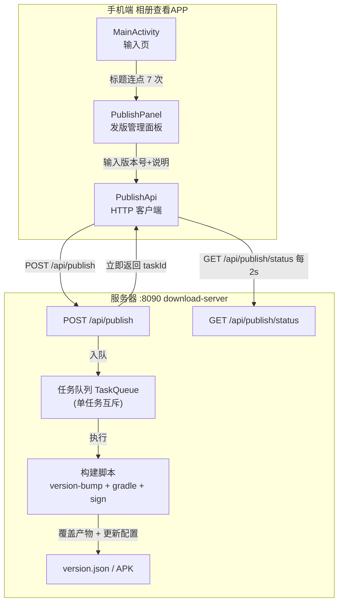

# In-App Publish Console (App 内云发布)

Feature Name: in-app-publish-console
Updated: 2026-08-15

## Description

在相册查看 APP 中内置隐藏的发版管理面板。开发者在 APP 内输入新版本号与更新说明，点击发布后由下载服务器自动完成：修改 build.gradle.kts 版本号 → gradle assembleRelease 构建 → zipalign/apksigner 签名 → 更新下载服务器版本配置。两个 APK（ScreenShare 主 APP + AlbumViewer）共用同一签名，版本信息（version.json）由下载服务器动态读取，发布后客户端检查更新链路自动生效。

## Architecture



## Components and Interfaces

### 1. AlbumViewer 端

#### 1.1 隐藏入口
- 输入页顶部标题（`tv_title`）连续点击检测：使用 `onClick` 记录时间戳数组，7 次点击且相邻间隔 ≤800ms 时触发 `showPublishPanel()`。
- 触发后每次重置计数，防误触。

#### 1.2 发版管理面板（PublishPanel）
- 用 `Dialog` 承载（复用全屏/普通对话框样式），布局含：
  - 当前版本显示（`BuildConfig.VERSION_NAME` + `BuildConfig.VERSION_CODE`）
  - `EditText etVersionName`：新版本号（正则 `^\d+\.\d+$` 校验）
  - `EditText etChangelog`：多行更新说明
  - 目标选择（RadioGroup）：主 APP / 相册查看 APP / 两者（默认两者）
  - 按钮：`btnPublish`（发布）、`btnCancel`（关闭）
  - 状态区：进度文本 + 重试按钮
- 校验失败用 `Toast` 提示。

#### 1.3 PublishApi
- 复用 OkHttpClient（AlbumApi 同款配置），baseUrl 取 `BuildConfig.PUBLISH_URL`（下载服务器公网地址，从 gradle.properties `screenshare.download.url` 注入）。
- 接口：
  - `publish(versionName, changelog, app) -> PublishTask(taskId)`：`POST /api/publish`
  - `publishStatus(taskId) -> PublishStatus(state, phase, versionName, error)`：`GET /api/publish/status?task=`
- 轮询：协程 `while(isActive) { delay(2000) }`，状态机 `building -> success | failed`。

### 2. 下载服务器端（download-server.js）

#### 2.1 POST /api/publish
- 请求体 JSON：`{versionName: "1.183", changelog: "…", app: "both"}`。
- 校验：versionName 匹配 `^\d+\.\d+$`；changelog 非空；app ∈ {main, albumviewer, both}。
- 并发控制：`if (currentTask) return 409 {error:"已有发布任务进行中"}`。
- 创建 task：`{id, state:"building", phase, log[], versionName, createdAt}`，启动异步执行，立即 `200 {taskId}`。

#### 2.2 构建任务执行（异步）
按 app 目标选择执行步骤，步骤写日志到 task.log：
1. **改版本号**：读取对应 build.gradle.kts，`versionCode` 递增 1，`versionName` 改为请求值（备份原内容到内存，失败回滚）。
   - app=main → `/workspace/app/build.gradle.kts`
   - app=albumviewer → `/workspace/albumviewer/build.gradle.kts`
   - app=both → 两者都改
2. **构建**：`child_process.exec` 执行 `export ANDROID_HOME=/opt/android-sdk && cd /workspace && ./gradlew assembleRelease`（依赖模块自动构建）。设置超时上限（如 15 分钟）。
3. **签名**：
   - 主 APP：zipalign `app/build/outputs/apk/release/app-release-unsigned.apk` → apksigner 签名 → `/workspace/ScreenShare-allarch-signed.apk`
   - AlbumViewer：zipalign `albumviewer/build/outputs/apk/release/app-release-unsigned.apk` → apksigner 签名 → `/workspace/AlbumViewer-signed.apk`
   - 签名命令（与既有发版流程一致）：keystore `/workspace/signing/release.keystore`，密码 `screenshare123`，alias `screenshare`，`apksigner verify` 验证 v2/v3。
4. **更新版本配置**：更新内存 `RELEASE_CONFIG.changelog`（并持久化到 `server/release-config.json` 供重启恢复）。
5. 完成后 task.state="success"；任一步骤异常 → 回滚版本号 → task.state="failed" + 记录 error。

#### 2.3 GET /api/publish/status
- `?task={id}`，返回 `{state, phase, versionName, error, log}`；task 不存在返回 404。

#### 2.4 version.json 联动
- 现有 `buildVersion()` 已动态读 gradle 版本号 + 计算 APK md5，`cachedMtime` 基于 APK mtime——签名覆盖 APK 后自动重新计算，changelog 从 `RELEASE_CONFIG`（含持久化文件）读取，无需重启。

### 3. gradle.properties / build.gradle.kts
- `gradle.properties` 新增 `screenshare.download.url=https://8090-6d639d2de20eb686.monkeycode-ai.online`。
- `albumviewer/build.gradle.kts` defaultConfig 新增 `buildConfigField("String","PUBLISH_URL",…screenshare.download.url…)`。

## Data Models

### PublishTask（服务器内存态）
```
PublishTask {
  id: string          // 短 id（时间戳 + 随机）
  state: "building" | "success" | "failed"
  phase: "bump" | "build" | "sign" | "config" | "done"
  versionName: string
  app: "main" | "albumviewer" | "both"
  log: string[]
  error: string | null
  createdAt: number
  bumpedBackup: { path: string, content: string } | null  // 版本号回滚备份
}
```

### PublishStatus（客户端轮询返回）
```
PublishStatus {
  state: string
  phase: string
  versionName: string
  error: string | null
}
```

### release-config.json（版本配置持久化）
```
{ "changelog": "…", "forced": false }
```

## Correctness Properties

1. **单任务互斥**：同一时刻最多一个构建任务；并发发布请求返回 409。
2. **失败原子性**：构建失败回滚 build.gradle.kts 版本号，线上 APK 与 version.json 保持上一次成功状态。
3. **签名一致性**：发布的 APK 必须 apksigner verify 通过（v2/v3），version.json 的 md5 与实际产物一致。
4. **下载不中断**：构建期间 APK 下载服务正常响应（构建不占用请求处理主线程）。
5. **版本号单调**：versionCode 只能递增（+1），不出现重复。

## Error Handling

| 场景 | 处理 |
|------|------|
| 版本号格式非法 | 客户端 Toast 提示，不发起请求；服务端二次校验返回 400 |
| changelog 为空 | 客户端 Toast 提示；服务端 400 |
| 已有构建任务 | 服务端 409，客户端显示「已有发布任务进行中」 |
| 网络异常 | 客户端显示失败原因，允许重试 |
| 构建失败（gradle/签名） | 任务标记 failed，回滚版本号，客户端显示 error |
| 服务器重启 | 内存任务丢失，客户端轮询 404 显示「任务不存在，服务器可能已重启」，release-config.json 保证 changelog 不丢 |
| 下载期间 APK 未更新 | 文件原子替换（先写临时文件再 rename）避免下载读到半截文件 |

## Test Strategy

1. **接口层（curl）**：
   - `POST /api/publish` 合法请求 → 200 taskId；重复请求 → 409；非法版本号 → 400。
   - `GET /api/publish/status` 轮询到 success，log 含 bump/build/sign 各阶段。
   - 发布后 `GET /version.json` 返回新 versionName/changelog，md5 与 `md5sum` 一致。
2. **发布回滚**：注入错误（如临时改坏 gradle 语法）触发失败 → 验证 build.gradle.kts 恢复原版本号、version.json 仍旧版本。
3. **签名验证**：`apksigner verify` 新产物通过 v2/v3。
4. **客户端（手动）**：标题连点 7 次打开发布面板 → 输入版本号发布 → 面板显示进度到成功 → 主 APP 检查更新弹新版本。
5. **并发**：两个发布请求同时发 → 一个 200 一个 409。
6. **下载不中断**：构建任务运行时并发下载 APK → 下载完整 md5 一致。

## References

[^1]: (Filename#L60-L99) - [/workspace/server/download-server.js 版本构建与缓存](server/download-server.js)
[^2]: (Filename#L128-L180) - [/workspace/server/download-server.js APK 下载与 Range 支持](server/download-server.js)
[^3]: (Filename) - [/workspace/albumviewer/build.gradle.kts 模块配置](albumviewer/build.gradle.kts)
[^4]: (Filename#L58-L99) - [/workspace/albumviewer/src/main/java/com/screenshare/albumviewer/MainActivity.kt 输入页与入口](albumviewer/src/main/java/com/screenshare/albumviewer/MainActivity.kt)
[^5]: (Filename) - [/workspace/albumviewer/src/main/java/com/screenshare/albumviewer/AlbumApi.kt HTTP 客户端模式](albumviewer/src/main/java/com/screenshare/albumviewer/AlbumApi.kt)
[^6]: (Filename#L1-L18) - [/workspace/server/download-server.js RELEASE_CONFIG 版本配置](server/download-server.js)
