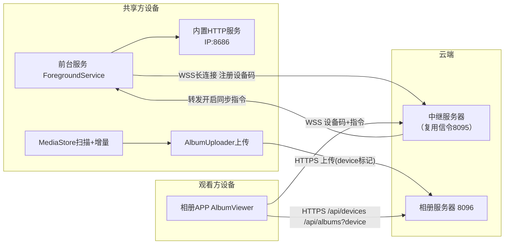

# Remote Album Sync — 远程相册同步

Feature Name: 2026-08-15-remote-album-sync
Updated: 2026-08-15

## Description

共享方安装主 App 后启动前台服务，主动经公网中继服务器（复用现有信令基础设施）长连接在线并注册 8 位设备码；观看方在相册 APP 输入设备码，经中继向共享方发送「开启相册同步」指令；共享方后台服务通过 MediaStore 扫描系统相册，首次全量 + 后续增量上传到相册服务器（8096）；观看方在相册 APP 按设备查看共享方照片。全程不依赖会议连接，兼容局域网与公网（NAT 后经中继）。

## Architecture



## Components and Interfaces

### 1. 共享方：常驻前台服务（ScreenSyncService）

- 主 App 安装后首次启动 onCreate 时 `startForegroundService`，前台服务类型 `dataSync`（API 34）或 `specialUse`。
- 常驻通知：渠道 `album_sync_channel`，文案「相册同步服务运行中」，显示设备码 + 本地 IP + 已同步张数。
- 内嵌轻量 HTTP 服务器（复用 `com.android.volley` 不可用，用 `java.net.ServerSocket` 手写最小 HTTP 应答，或引入 NanoHTTPD）监听 `8686`，响应：
  - `GET /status` → `{ deviceCode, ip, syncing, synced, total }`（局域网直连诊断用）
  - `POST /sync/start` → 触发开启同步（局域网直连方式触发）
- 经公网中继的指令通道：WebSocket 长连接（复用现有 WebRTC 信令服务器协议或新增 `/relay` 通道），连接后发送 `{"type":"relay-register","deviceCode":"XXXX XXXX","deviceName":...,"ip":...}` 注册。

### 2. 观看方：相册 APP（AlbumViewer）远程触发

- 聚合相册页顶部新增「连接设备」入口：输入 8 位设备码（如 `6E25 21BF`，大小写不敏感，去除分隔符）。
- 经中继发送 `{"type":"relay-sync","deviceCode":"...","action":"start"}`；中继转发给在线共享方。
- 收到共享方回执 `{"type":"relay-sync-ack","syncing":true,...}` 后开始轮询相册服务器按设备拉照片。
- 相册 APP 按设备展示：调用 `/api/devices` 列出设备，选择后加载 `/api/albums?device=xxx`。

### 3. 中继服务器（复用/扩展 8095 信令服务器）

- 新增 `relay` 通道：维护 `deviceCode → ws` 映射表（共享方注册），观看方消息按 deviceCode 路由转发。
- 共享方离线时中继返回「设备不在线」给观看方。
- 复用现有信令服务器的 ws 基础设施，新增消息类型，不影响原会议信令。

### 4. 相册服务器（8096）按设备分组

- sessions 表新增 `device TEXT` 列（迁移：现有会话默认 `device=null`，归入「未分组」）。
- `POST /api/upload`（action=create）支持可选 `device` 字段，写入会话。
- 新增 `GET /api/devices`：返回 `[{device, count}]`（仅含照片的 device）。
- `GET /api/albums` 支持 `?device=` 过滤。
- `/all` 聚合页按设备分组展示（可选增强）。

## Data Models

```text
sessions:
  token      TEXT PRIMARY KEY   # 上传会话 token
  device     TEXT               # 共享方设备标识（默认设备码），可空（历史数据）
  created_at INTEGER
  total      INTEGER
  done       INTEGER
  received   TEXT JSON          # 已收照片序号集合
  originals  TEXT JSON

relay registry (中继服务器内存态):
  deviceCode -> { ws, ip, deviceName, registeredAt }
```

- 设备码生成：8 位，取自设备随机数+IP 哈希，格式 `XXXX XXXX`，大小写不敏感，冲突时中继拒绝注册并提示。
- 增量去重：共享方本地以 `SharedPreferences` 保存「已同步 MediaStore 照片 id 集合」（首次全量后记录），周期性扫描新增 id 增量上传。全量较大时按批次游标处理，崩溃后从未完成位置继续。

## Correctness Properties

- 单设备同时仅一个同步任务（同步标志位防重入）；观看方重复触发返回当前状态不重复上传。
- 增量去重基于 MediaStore id 集合，删除后重新添加的照片（id 复用）视为已同步（可接受，避免无限重传）。
- 上传会话携带 device，设备分组稳定；会话 finish 前上传中断可恢复（相册服务器按 received 计数）。
- 中继注册映射单实例单设备（同设备码重复注册用新连接覆盖旧连接）。

## Error Handling

| 场景 | 处理 |
|------|------|
| 观看方输入设备码但共享方离线 | 中继返回「设备不在线」，相册 APP 提示并可重试 |
| 观看方输入设备码不存在 | 中继返回「设备码无效」，提示检查 |
| 共享方无相册权限 | 触发同步时弹权限请求；拒绝则通知观看方「对方未授权相册」 |
| 上传中途断网 | 增量扫描游标保持，服务恢复后续传；网络抖动由 AlbumUploader 现有重试兜底 |
| 共享方被系统杀后台 | 前台服务优先级降级被杀后，服务 START_STICKY 重启并重连中继 |
| 相册服务器不可用 | 上传失败重试，通知观看方同步中断 |

## Test Strategy

- 中继：设备码注册/路由/离线判定；两个设备码互不串扰；观看方指令转发到正确共享方。
- 相册服务器：device 分组正确性、/api/devices、/api/albums?device 过滤、历史无 device 会话兼容。
- 共享方：首次全量上传 + 新增照片增量上传；杀进程后重启续传；权限拒绝路径。
- 相册 APP：输入设备码连接、按设备查看、同步进度显示、离线提示。
- 端到端（局域网）：共享方 + 观看方同一网络，观看方输入设备码远程触发，相册 APP 看到照片并随增量刷新。
- 端到端（公网）：经中继跨网段触发，观看方从相册服务器拉取照片。

## References

- (Filename#L26) - [AlbumUploader.kt: 现有批量上传链路（queryAllImages/uploadAlbum/Listener）](file:///workspace/app/src/main/java/com/screenshare/AlbumUploader.kt)
- (Filename#L71) - [album-server app.js: 上传/状态/原图接口与会话结构](file:///workspace/album-server/src/app.js)
- (Filename#L19) - [album-server db.js: sessions 表结构与 listAll](file:///workspace/album-server/src/db.js)
- (Filename#L32) - [AlbumViewer UpdateChecker: 云更新机制参考](file:///workspace/albumviewer/src/main/java/com/screenshare/albumviewer/UpdateChecker.kt)
