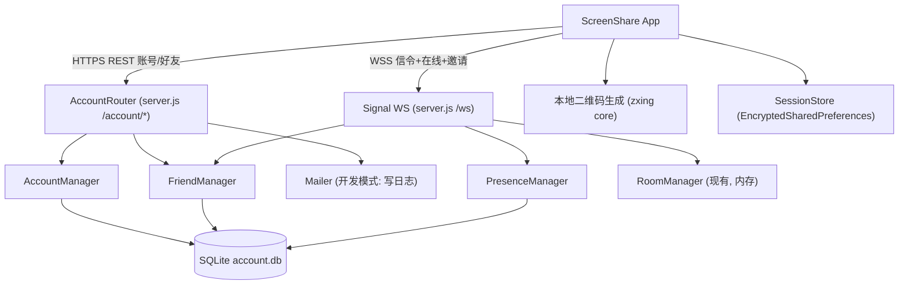

# 账号与好友系统（Account & Friends）

Feature Name: account-friends
Updated: 2026-09-18

## Description

在现有「4 位房间号 + 临时会话」的屏幕共享体系上补齐用户身份层与好友层：邮箱密码注册登录、6 位好友码与二维码、好友申请与列表、在线状态、好友列表一键发起共享。服务端复用现有 8095 端口的 Node 进程，新增账号 HTTP 路由与信令 WS 消息类型，数据落盘 SQLite；客户端复用现有 okhttp 与信令连接，新增账号客户端与好友页数据层。

本设计覆盖 `.monkeycode/specs/2026-09-18-account-friends/requirements.md` 的 9 个需求。

## Architecture



设计要点：

- **单进程单端口**：账号 REST 路由与信令 WS 共用 8095 服务，账号接口挂在 `/account/*` 与 `/friends/*`，避免跨进程维护在线状态。
- **持久化用 `node:sqlite`**：Node v22 内置，不引入新依赖；用户量小，单文件 `server/data/account.db` 足够。
- **在线状态在内存 + SQLite 落 last_seen**：`PresenceManager` 维护 `userId → Set<ws>`，任一连接在线即在线，全部断开才离线，满足多设备同时在线。
- **一键共享复用现有房间机制**：host 侧仍生成本地 4 位房间号，服务端仅新增「把房间号定向推送给好友」的信令，观看端 join 流程不变。

## Components and Interfaces

### 服务端（新增于 `server/`，复用现有进程）

| 组件 | 职责 | 关键接口 |
|------|------|----------|
| `AccountManager.js` | 注册、登录、登出、改密、资料、好友码生成 | `register(email, code, password)`、`login(email, password)`、`logout(token)`、`resetPassword(email, code, newPassword)`、`updateProfile(userId, patch)` |
| `FriendManager.js` | 好友申请、接受/拒绝、列表、删除 | `request(fromId, friendCode)`、`accept(userId, requestId)`、`reject(userId, requestId)`、`list(userId)`、`remove(userId, friendId)` |
| `PresenceManager.js` | 维护 userId↔连接，广播在线状态 | `attach(userId, ws)`、`detach(userId, ws)`、`isOnline(userId)`、`friendsOf(userId)` 回调 |
| `Mailer.js` | 发送验证码；开发模式写日志/固定码 | `sendCode(email, code, purpose)` |
| `RateLimiter.js` | 接口与验证码限流 | `hit(key, limit, windowMs)` |
| `VerificationStore.js` | 验证码签发校验（SQLite） | `issue(email, purpose)`、`verify(email, purpose, code)` |
| `AccountRouter`（server.js 内） | HTTP 路由分发与令牌鉴权 | `handle(req, res)` |
| `SignalExtension`（server.js 内） | 扩展 WS 消息类型与鉴权认领 | `handleMessage(ws, msg)` |

### 客户端（`app/src/main/java/com/screenshare/`）

| 组件 | 职责 |
|------|------|
| `AccountClient.kt` | 账号与好友 REST 调用（复用 okhttp），返回统一结果类型 |
| `SessionStore.kt` | 令牌与用户资料持久化（`EncryptedSharedPreferences`） |
| `FriendsFragment.kt` | 好友页：RecyclerView 列表 + 待处理申请 + 空态（现有空态保留） |
| `FriendsAdapter.kt` | 绑定 `item_friend_card.xml`，点击发起共享/长按删除 |
| `AddFriendDialog.kt` | 展示本人好友码与二维码、输入好友码发起申请、处理待处理申请（首期不含相机扫码） |
| `ShareInviteHandler.kt` | 监听 `share-invite`，弹邀请界面，接受后进观看端 |
| `SignalClient.kt`（扩展） | 新增 `auth` 认领与好友相关消息的发送/回调 |

### 账号 HTTP API

| 方法 | 路径 | 鉴权 | 请求 | 响应 |
|------|------|------|------|------|
| POST | `/account/register/request-code` | 否 | `{email}` | `{ok}` |
| POST | `/account/register` | 否 | `{email, code, password}` | `{userId, token, profile}` |
| POST | `/account/login` | 否 | `{email, password}` | `{userId, token, profile}` |
| POST | `/account/logout` | 是 | — | `{ok}` |
| POST | `/account/password/request-reset` | 否 | `{email}` | `{ok}` |
| POST | `/account/password/reset` | 否 | `{email, code, newPassword}` | `{ok}` |
| GET | `/account/me` | 是 | — | `profile` |
| PATCH | `/account/profile` | 是 | `{nickname?, avatar?}` | `profile` |
| GET | `/friends` | 是 | — | `[{userId, nickname, avatar, online}]` |
| GET | `/friends/requests` | 是 | — | `[{requestId, from:{userId, nickname}}]` |
| POST | `/friends/request` | 是 | `{friendCode}` | `{requestId}` |
| POST | `/friends/accept` | 是 | `{requestId}` | `{friend}` |
| POST | `/friends/reject` | 是 | `{requestId}` | `{ok}` |
| DELETE | `/friends/{userId}` | 是 | — | `{ok}` |

鉴权头：`Authorization: Bearer <token>`。

### 信令 WS 消息（在现有类型上新增）

| 方向 | type | 载荷 | 说明 |
|------|------|------|------|
| C→S | `auth` | `{token}` | 连接后认领身份；成功回 `auth-ok` |
| S→C | `auth-ok` | `{userId, nickname}` | 认领成功 |
| S→C | `auth-error` | `{reason}` | 令牌无效 |
| S→C | `presence` | `{userId, online}` | 好友上下线推送 |
| S→C | `friend-request` | `{requestId, from}` | 收到好友申请 |
| S→C | `friend-accepted` | `{friend}` | 申请被同意 |
| C→S | `share-invite` | `{toUserId, code}` | 向好友定向推送房间号 |
| S→C | `share-invite` | `{inviteId, code, from}` | 收到共享邀请 |
| C→S | `share-invite-accept` | `{inviteId}` | 接受邀请 |
| C→S | `share-invite-reject` | `{inviteId}` | 拒绝邀请 |
| S→C | `share-invite-result` | `{inviteId, accepted}` | 通知发起方结果 |

现有 `create / join / accept / reject / relay / pls-join / ping` 保持不变。

## Data Models

### SQLite 表（`server/data/account.db`）

```sql
CREATE TABLE users (
  id            TEXT PRIMARY KEY,       -- UUID
  email         TEXT UNIQUE NOT NULL,
  password_hash TEXT NOT NULL,          -- scrypt 哈希
  salt          TEXT NOT NULL,
  nickname      TEXT NOT NULL,
  avatar        TEXT NOT NULL DEFAULT '', -- 颜色档位索引 0-5
  friend_code   TEXT UNIQUE NOT NULL,   -- 6 位大写字母数字
  created_at    INTEGER NOT NULL
);

CREATE TABLE sessions (
  token_hash  TEXT PRIMARY KEY,         -- SHA-256(token)，不存明文
  user_id     TEXT NOT NULL,
  device_info TEXT,
  created_at  INTEGER NOT NULL,
  last_seen   INTEGER NOT NULL,
  expires_at  INTEGER NOT NULL
);

CREATE TABLE friends (
  user_id    TEXT NOT NULL,
  friend_id  TEXT NOT NULL,
  created_at INTEGER NOT NULL,
  PRIMARY KEY (user_id, friend_id)
);  -- 双向各存一行，保证对称

CREATE TABLE friend_requests (
  id         TEXT PRIMARY KEY,
  from_user  TEXT NOT NULL,
  to_user    TEXT NOT NULL,
  status     TEXT NOT NULL,   -- pending | accepted | rejected
  created_at INTEGER NOT NULL
);

CREATE TABLE verification_codes (
  email      TEXT NOT NULL,
  purpose    TEXT NOT NULL,   -- register | reset
  code       TEXT NOT NULL,
  expires_at INTEGER NOT NULL,
  attempts   INTEGER NOT NULL DEFAULT 0,
  PRIMARY KEY (email, purpose)
);
```

内存状态（不落盘）：`PresenceManager` 的 `userId → Set<ws>`；`RoomManager` 的房间（现有）。

### 客户端持久化（`album_sync` 之外新增 `account` prefs，EncryptedSharedPreferences）

`token`、`userId`、`nickname`、`avatar`、`friendCode`。

## Correctness Properties

1. **好友关系对称**：`friends` 含 `(a,b)` 当且仅当含 `(b,a)`。
2. **好友码唯一**：任何时刻不存在两个用户持有相同 `friend_code`。
3. **多设备在线聚合**：`isOnline(u)` 为真当且仅当 `u` 至少有一个活跃连接。
4. **令牌不可逆**：数据库仅存 `SHA-256(token)`，明文令牌只出现在签发响应中。
5. **密码不可逆**：数据库仅存 scrypt 哈希与盐，任何接口响应不含密码、哈希或盐。
6. **改密即失联**：重置密码成功后，该用户所有既有 `sessions` 记录失效。
7. **邀请定向**：`share-invite` 仅投递给发起方的在线好友，不广播。
8. **关系可查询**：`/friends` 仅返回与请求方存在好友关系的账号资料。

## Error Handling

| 场景 | 处理 |
|------|------|
| 邮箱已注册 / 好友码无效 / 昵称超长 | 返回具体错误码与可读文案，HTTP 4xx |
| 密码强度不足 | 返回规则说明，HTTP 400 |
| 连续登录失败、验证码失败、接口高频 | `RateLimiter` 按邮箱与来源 IP 限流，HTTP 429 |
| 令牌缺失/过期/登出后使用 | HTTP 401，客户端清除本地会话并跳登录 |
| 邮件发送（开发模式） | 验证码写入服务端日志，接口返回成功，便于自测 |
| 好友离线时发起共享 | 服务端拒绝并回 `share-invite-result{accepted:false, reason:"offline"}`，发起方提示 |
| 好友申请重复 / 自己加自己 | 忽略重复申请返回当前关系；自己加自己返回 400 |
| 网络异常 | `AccountClient` 返回失败结果，UI 提示并可重试；令牌 401 时统一跳登录 |
| SQLite 不可用（实验性 API 变更） | 启动时校验，失败则进程退出并打印明确原因 |

## Test Strategy

- **服务端单元测试**（`node:test`，`server/test/`）：`AccountManager`（注册/登录/改密/限流）、`FriendManager`（申请/接受/对称性/去重）、`PresenceManager`（多设备聚合）、`VerificationStore`（过期与尝试上限）。
- **服务端集成测试**：以 `http` 直连 8095 跑完整注册→登录→加好友→列表流程；WS 测试覆盖 `auth` 认领与 `share-invite` 投递。
- **客户端单元测试**：`SessionStore` 读写与清除、`AccountClient` 响应解析。
- **端到端手测**：两设备（realme host / OPPO viewer）注册两个账号 → 互加好友 → 在线状态互通 → 一键发起共享 → 对方接受进入观看端；覆盖多设备同账号登录与登出。
- **回归**：确认现有房间号手输共享、`pls-join`、相册同步不受影响。

## References

[^1]: (当前工作区/server/server.js) - [信令服务 HTTP 路由与 WS 消息处理](server/server.js)
[^2]: (当前工作区/server/RoomManager.js) - [房间生命周期与 host 离开销毁](server/RoomManager.js)
[^3]: (当前工作区/server/AuthManager.js) - [现有房间 token 签发](server/AuthManager.js)
[^4]: (当前工作区/app/src/main/java/com/screenshare/SignalClient.kt) - [客户端信令连接与消息类型](app/src/main/java/com/screenshare/SignalClient.kt)
[^5]: (当前工作区/app/src/main/java/com/screenshare/FriendsFragment.kt) - [好友页现状](app/src/main/java/com/screenshare/FriendsFragment.kt)
[^6]: (当前工作区/.monkeycode/specs/2026-09-18-account-friends/requirements.md) - [本特性需求文档](.monkeycode/specs/2026-09-18-account-friends/requirements.md)
