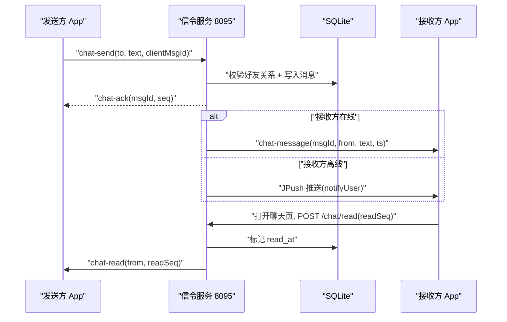

# 好友聊天（Friend Chat）

Feature Name: friend-chat
Updated: 2026-09-28

## Description

在现有账号与好友体系上补齐一对一文字聊天。复用 8095 信令进程的 WS 通道做实时投递，复用 SQLite 做消息持久化，复用 notifyUser 做离线推送。首期纯文本私聊，含离线存储、未读提醒、已读回执、历史记录分页。覆盖 `requirements.md` 的 9 个需求。

## Architecture



设计要点：

- **单进程单端口**：聊天逻辑全部并入 8095 现有进程，新增 `ChatManager` 管理消息生命周期，REST 路由挂 `/chat/*`，WS 消息类型与现有信令共存，避免跨进程维护在线状态。
- **持久化用 `node:sqlite`**：与现有 account.db 同库新增 messages 表，复用已有连接与迁移机制。
- **实时投递走 PresenceManager**：消息持久化后查接收方在线状态，在线则推 `chat-message`，离线则走已有 notifyUser（JPush）。
- **有序自增 seq**：消息排序与已读位置标记统一用自增 `seq`，业务唯一 ID 用 `id`（TEXT）做客户端去重。
- **幂等发送**：客户端生成 `clientMsgId`，服务端按 `(from, clientMsgId)` 去重，断网重连重发不会产生重复消息。
- **客户端本地库（SQLiteOpenHelper）**：消息落本地实现离线查看与秒开。本地库只追加不主动清理（服务端 1000 条治理只管服务端存储）。同步策略：进入聊天页先显示本地最近一批，再以本地最大 seq 为游标增量拉新；上滑以本地最小 seq 为游标翻页拉旧。发送先写本地（发送中），ack 后补齐服务端 id/seq。

## Components and Interfaces

### 服务端（新增于 `server/`）

| 组件 | 职责 | 关键接口 |
|------|------|----------|
| `ChatManager.js` | 消息收发、持久化、历史分页、未读计数、已读标记、存储治理 | `send(fromId, toId, text, clientMsgId)`、`history(userId, friendId, beforeSeq, limit)`、`unread(userId)`、`markRead(userId, friendId, readSeq)` |

`ChatManager` 由 `server.js` 实例化，注入 `friendManager`（校验好友关系）、`presenceManager`（在线状态）、`notifyUser`（离线推送）、`rateLimiter`（限流）。REST 路由由 `AccountRouter` 转发，WS 消息由现有 `handleMessage` 分发。

### 客户端（`app/src/main/java/com/screenshare/`）

| 组件 | 职责 |
|------|------|
| `ChatActivity.kt` | 聊天页：消息列表（RecyclerView 气泡）+ 输入框 + 发送 + 顶栏「发起共享」按钮 |
| `ChatAdapter.kt` | 绑定消息气泡，区分发送/接收方向，展示已读状态 |
| `ChatDbHelper.kt` | SQLiteOpenHelper：本地 messages 表的增删改查（插入、按会话分页、未读计数、标记已读） |
| `ChatSync.kt` | 同步协调：进入聊天页增量拉新、上滑翻页拉旧、ack/到达/已读写回本地库 |
| `ChatClient.kt` | REST 封装：拉取历史、上报已读（复用 okhttp，加于 `AccountClient`） |
| `SignalClient.kt`（扩展） | `chat-send` 发送与 `chat-ack`/`chat-message`/`chat-read`/`chat-unread`/`chat-rejected` 回调 |
| `FriendsFragment.kt`（改造） | 点击好友改为打开 `ChatActivity`；列表项显示未读角标（查本地库） |

### REST API（新增，挂 `/chat/*`）

| 方法 | 路径 | 鉴权 | 请求 | 响应 |
|------|------|------|------|------|
| GET | `/chat/history/{friendId}` | 是 | `?afterSeq=` 或 `?beforeSeq=` 二选一，`&limit=50` | `{messages: [{id, seq, from, text, ts, read}]}` |
| POST | `/chat/read/{friendId}` | 是 | `{readSeq}` | `{ok}` |
| GET | `/chat/unread` | 是 | — | `{items: [{userId, count}]}` |

- `afterSeq=N`：返回 `seq > N` 的最新 limit 条（增量拉新，进入聊天页同步用，本地为空时 N=0）
- `beforeSeq=N`：返回 `seq < N` 的最新 limit 条（上滑翻页拉旧）
- 查询结果按两个方向合并（from/to 覆盖双方）再按 seq 排序

鉴权头：`Authorization: Bearer <token>`（与现有 `/friends` 一致）。

### 信令 WS 消息（在现有类型上新增）

| 方向 | type | 载荷 | 说明 |
|------|------|------|------|
| C→S | `chat-send` | `{toUserId, text, clientMsgId}` | 发送消息 |
| S→C | `chat-ack` | `{clientMsgId, id, seq, ts}` | 服务端已持久化 |
| S→C | `chat-message` | `{id, seq, from, text, ts}` | 实时投递新消息 |
| S→C | `chat-rejected` | `{clientMsgId, reason}` | 非好友/限流/超长 |
| S→C | `chat-read` | `{from, readSeq}` | 对方已读位置 |
| S→C | `chat-unread` | `{items: [{userId, count}]}` | 上线时下发未读数 |

## Data Models

### SQLite 新增表

```sql
CREATE TABLE IF NOT EXISTS messages (
  seq         INTEGER PRIMARY KEY AUTOINCREMENT,
  id          TEXT NOT NULL UNIQUE,
  from_user   TEXT NOT NULL,
  to_user     TEXT NOT NULL,
  text        TEXT NOT NULL,
  created_at  INTEGER NOT NULL,
  read_at     INTEGER
);
CREATE INDEX IF NOT EXISTS idx_messages_conv ON messages(from_user, to_user, seq);
CREATE INDEX IF NOT EXISTS idx_messages_read ON messages(to_user, from_user, seq) WHERE read_at IS NULL;
```

- 会话 = `(from_user, to_user)` 双向，查询历史取两个方向的并集按 seq 排序
- `seq` 单调自增，用于排序与已读位置；`id` 做客户端去重
- `read_at` 为空即未读；已读上报按 `seq <= readSeq` 批量置位

### 客户端本地表（SQLiteOpenHelper）

```sql
CREATE TABLE IF NOT EXISTS messages (
  id           TEXT PRIMARY KEY,   -- 服务端 ID（发送中暂用 clientMsgId 占位）
  seq          INTEGER NOT NULL DEFAULT 0,  -- 服务端序号，排序与已读位置；发送中为 0
  conv_key     TEXT NOT NULL,      -- 会话键：己方Id与对方Id排序拼接，双向归一会话
  from_me      INTEGER NOT NULL,   -- 1=我发的 0=对方发的
  text         TEXT NOT NULL,
  ts           INTEGER NOT NULL,
  status       INTEGER NOT NULL,   -- 0=发送中 1=已发送 2=发送失败
  read         INTEGER NOT NULL DEFAULT 0  -- 仅对方发来的消息：0=未读 1=已读
);
CREATE INDEX IF NOT EXISTS idx_local_conv ON messages(conv_key, seq);
```

- `conv_key` 把两个方向的会话归一（`min(uid)+":"+max(uid)`），本地查询一个会话只需一次索引扫描
- 本地库只追加不主动清理；服务端 1000 条治理只作用于服务端存储
- 发送中的消息先用 clientMsgId 占位写本地（status=0），ack 后按 clientMsgId 更新为服务端 id/seq 并置 status=1

### 客户端数据类

```kotlin
data class ChatMessage(
    val id: String,        // 服务端 ID，去重主键
    val seq: Long,         // 排序与已读位置
    val fromMe: Boolean,   // 渲染左右气泡
    val text: String,
    val ts: Long,
    val read: Boolean      // 已读回执
)
```

## Correctness Properties

- **顺序单调**：同一会话内消息按 seq 单调递增，跨方向合并后时间线一致
- **去重**：同一 `id` 在服务端只持久化一次（UNIQUE 约束），客户端只渲染一次
- **幂等发送**：断网重连后重发同一 `clientMsgId`，服务端返回同一 `id/seq`，不产生重复
- **未读一致**：未读数严格等于 `to_user=自己 AND read_at IS NULL` 的行数，清零即标记 read_at；本地角标与历史拉取以同一字段为准
- **好友边界**：非好友关系一律 `chat-rejected`，无法发送
- **已读不回退**：`markRead` 只置位 `read_at` 为空的行，不重置已读状态
- **本地库只增不覆盖消息体**：本地行以 id 为主键，重复插入（重新同步、重装后拉取）直接忽略，不覆盖已有内容
- **离线可读**：无网络时聊天页仍能渲染本地库已有消息，仅新消息拉取与发送失败

## Error Handling

| 场景 | 处理 |
|------|------|
| 发送时 WS 未连接 | 消息标记「发送中」暂存本地，连接恢复后按 clientMsgId 重发 |
| 服务端 reject（限流/非好友） | 消息标记「发送失败」并提示原因，可点击重试（仅非限流原因） |
| 历史拉取失败 | 聊天页显示错误态与重试按钮，不崩溃 |
| 持久化失败（DB 异常） | 回 `chat-rejected`，客户端标记失败，不丢消息也不假装成功 |
| 多设备同时在线重复投递 | 客户端按 id 去重，重复到达只渲染一次（本地库 INSERT OR IGNORE 兜底） |
| 推送失败 | 记录日志，消息仍在服务端，用户上线后经 `chat-unread` 与历史拉取兜底 |
| 本地库写入失败（磁盘满/损坏） | 消息仍在服务端，下次同步按 seq 游标重新拉取补齐；聊天页回退为仅服务端模式 |
| 增量同步时序错乱（本地 seq 大于服务端返回） | 以服务端 seq 为准重建本地游标，不丢失已渲染消息 |

## Test Strategy

- **服务端**（Node 脚本或现有测试模式）：
  - 好友校验：非好友发送返回 rejected
  - 去重：同一 clientMsgId 两次写入只存一条
  - 限流：10 秒内第 31 条被拒
  - 未读计数与清零：发 3 条 → 未读 3 → markRead → 未读 0
  - 已读批量置位：readSeq 之前的未读行全部置位、之后不变
  - 历史分页：beforeSeq 游标正确翻页、两个方向合并排序正确
  - 存储治理：单会话超出 1000 条后最早条目被异步清理
- **客户端**（真机日志验证，沿用 AppLogger 打点）：
  - 发送→ack→气泡从「发送中」变为「已发送」
  - 对方在线时实时收到、离线时上线后经历史拉取补齐
  - 重复到达的消息只显示一条
  - 未读角标随消息到达递增、打开聊天页后清零
  - 已读回执：对方打开后自己的气泡出现已读标记

## References

[^1]: (Filename) 好友系统设计文档，聊天复用其好友关系与在线状态机制 — `.monkeycode/specs/2026-09-18-account-friends/design.md`
[^2]: (Filename) 需求文档，本设计覆盖其 9 个需求 — `.monkeycode/specs/2026-09-28-friend-chat/requirements.md`
[^3]: (Filename) 在线状态与推送通道 — `server/PresenceManager.js`
[^4]: (Filename) 现有 REST 路由分发模式 — `server/AccountRouter.js`
