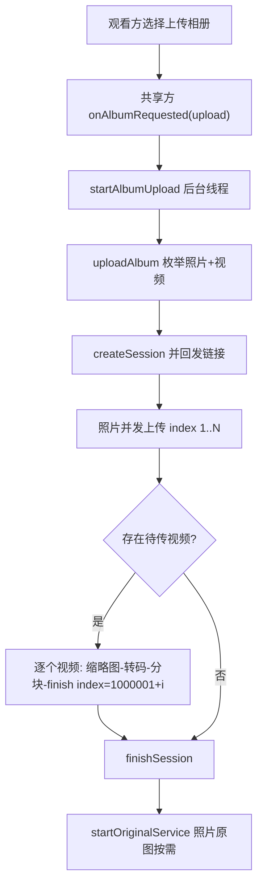

# 相册上传支持视频（album-upload-video）

Feature Name: album-upload-video
Updated: 2026-09-07

## Description

为会议内「上传相册到服务器」链路（AlbumUploader.uploadAlbum）补齐视频上传：照片并发上传完成后，串行把本机相册视频经「缩略图 → 转码 720p/2Mbps → 分块上传 → finish 标记」管道写入同一相册会话（index 从 1000001 起）。观看端（相册 App / 网页）无需改动即可在网格中看到并播放视频条目。

## Architecture

复用既有设施，新增代码集中在 AlbumUploader.uploadAlbum 内的视频阶段：

| 既有设施 | 位置 | 复用方式 |
|---|---|---|
| 视频枚举 queryAllVideoIds | AlbumUploader.kt:81 | 直接调用（无视频权限时自然返回空列表 → 退化仅照片） |
| 视频上传管道 uploadVideoWithProgress | AlbumUploader.kt:291 | 直接调用（缩略图/转码/分块/finish 全内置，失败返回 false） |
| 视频索引基数约定 | ScreenSyncService.kt:63 | 常量上移到 AlbumUploader 公开，两处共用消除魔法数重复 |
| 视频条目展示 | 相册 App GridAdapter / 网页 web.js | 零改动（v1.188/v1.191 已支持） |

## Components and Interfaces

### AlbumUploader（改动核心）

1. 新增公开常量 `VIDEO_INDEX_BASE = 1_000_000`；ScreenSyncService 的私有同名常量改为引用它（`AlbumUploader.VIDEO_INDEX_BASE`），行为不变。
2. `uploadAlbum` 扩展：
   - 枚举阶段：`val videoIds = queryAllVideoIds(context)`；照片与视频均为空 → `EmptyAlbumException`（保持现有异常语义）。
   - 照片阶段：原并发管线不动（onSessionCreated 回发链接、缩略图先行、原图按需）。
   - 视频阶段（照片 awaitTermination 之后、finishSession 之前）：串行循环 `videoIds.forEachIndexed { i, vid -> ... }`：
     - 循环每轮先检查 `cancel()`，取消则跳出；
     - `index = VIDEO_INDEX_BASE + i + 1`（会话为本次新建，无跨运行续传，直接用循环序号）；
     - 调 `uploadVideoWithProgress(context, baseUrl, token, vid, index) { }`，返回 false 记日志跳过；
     - 单视频成功与否均不影响后续视频。
   - 视频阶段纳入现有 try/catch：取消或异常路径仍走 `bestEffortFinish`。
   - 完成路径：`finishSession` → `onComplete` → `startOriginalService`（照片原图按需，行为不变）。
3. `EmptyAlbumException` 语义扩展：仅在「照片+视频均为空」时抛出。

### ScreenSyncService（1 行）

`VIDEO_INDEX_BASE` 私有常量删除，改引用 `AlbumUploader.VIDEO_INDEX_BASE`，视频 index 计算逻辑不变。

### MainActivity（文案）

`startAlbumUpload` catch 分支中 `EmptyAlbumException` 的提示文案「相册没有照片」→「相册没有照片或视频」。

### 观看端（零改动）

相册 App（AlbumPhoto.isVideo → VideoView 播放）与网页端（▶ 角标内嵌 video）在会话 videos 集合变化后自动展示新视频条目。

## Data Models

相册会话内条目布局（服务器 8096 既有模型，无改动）：

| 条目 | index 范围 | 存储 | 展示 |
|---|---|---|---|
| 照片 | 1..N | `{token}/000N.jpg`（缩略图）+ 原图按需 | 网格缩略图 → 点击看原图 |
| 视频 | 1000001..1000000+M | `{token}/video/000N.mp4` + `{token}/000N.jpg`（首帧缩略图 pad） | 网格 ▶ 角标 → 内嵌/VideoView 播放 |

视频 index 取 `VIDEO_INDEX_BASE + i + 1`（i 为本次视频列表循环序号）。uploadAlbum 会话为一次性新建（与 ScreenSyncService 的跨运行续传会话不同），循环序号即会话内序号，两者约定一致。

## Correctness Properties

1. **索引隔离**：视频 index ≥ 1000001 且照片 index ≤ N（N 为照片数），两者在任一会话内永冲突。
2. **失败隔离**：任一视频失败（false/异常）不改变其余视频与照片的上传结果；≥1 个内容成功即正常 finish 并回发链接。
3. **空判定**：照片数 + 视频数 = 0 时抛 EmptyAlbumException 且无会话链接回发；仅视频时仍创建会话并完成上传。
4. **取消边界**：cancel 置位后最多再完成当前一个视频即停止；取消/异常路径必经 bestEffortFinish，服务器会话不悬挂。
5. **资源回收**：每次转码的临时 MP4（cacheDir/album_video）在上传结束（成功/失败）后即删除（uploadVideoWithProgress 既有行为）。

## Error Handling

| 场景 | 处理 |
|---|---|
| 视频缩略图提取失败 | uploadVideoWithProgress 返回 false → 日志 + 跳过 |
| 转码异常/输出空文件 | 同上（临时文件已被管道删除） |
| 分块上传失败/finish 失败 | 同上 |
| 全部视频失败但照片有成功 | 会话正常完成，链接照常回发（照片可看） |
| 照片+视频全为空 | EmptyAlbumException → 观看方提示「相册没有照片或视频」 |
| 上传中取消（会议结束） | 照片阶段：既有逐张检查；视频阶段：当前视频完成后跳出 → bestEffortFinish |
| 无 READ_MEDIA_VIDEO 权限 | queryAllVideoIds 返回空 → 自动仅照片，无新增弹窗 |

## Test Strategy

1. **编译验证**：`./gradlew :app:assembleRelease` 通过（本环境无真机，与历次发版一致）。
2. **静态审查**：index 隔离、异常路径 bestEffortFinish、临时文件清理三处重点核对。
3. **服务器侧冒烟**（curl 模拟 video-thumb/upload/finish 链路已在 v1.191 验证过，本次无服务器改动，仅确认版本兼容）。
4. **真机验证点**（发版后）：含视频的相册上传后，相册 App/网页网格出现 ▶ 视频条目并可播放；视频转码期间共享画面无明显卡顿；会议中取消上传后台及时停止。

## References

[^1]: (Filename#L475) app/src/main/java/com/screenshare/AlbumUploader.kt — uploadAlbum 照片管线
[^2]: (Filename#L291) app/src/main/java/com/screenshare/AlbumUploader.kt — uploadVideoWithProgress 视频上传管道
[^3]: (Filename#L455) app/src/main/java/com/screenshare/ScreenSyncService.kt — 视频串行上传与 index 约定
[^4]: (Filename#L1529) app/src/main/java/com/screenshare/MainActivity.kt — startAlbumUpload 调用与错误文案
