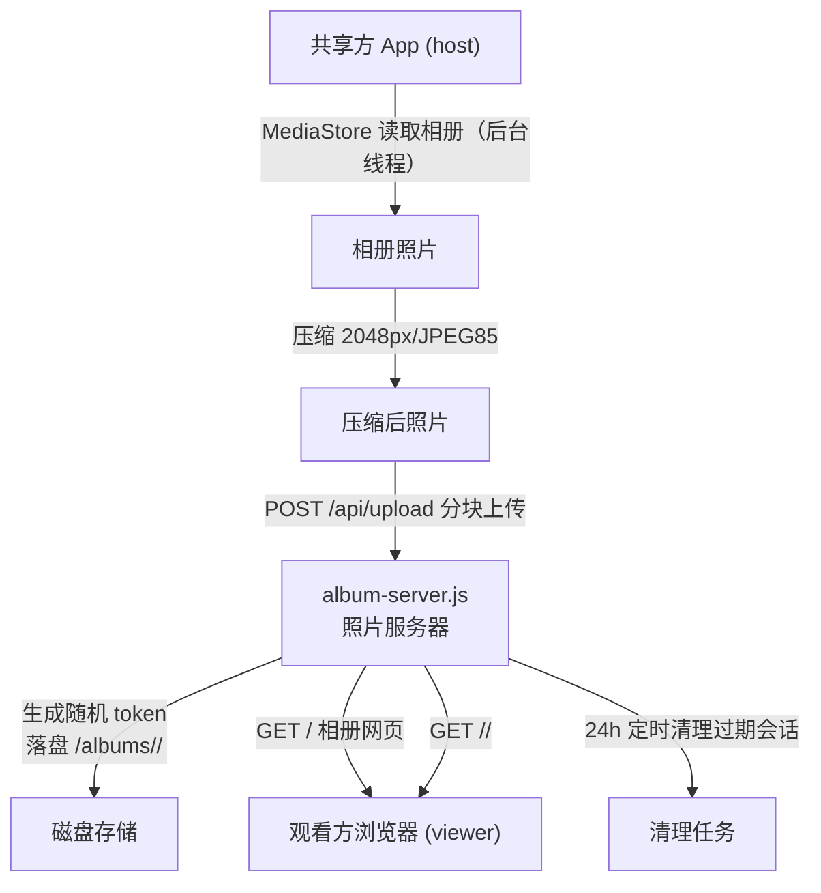

# 相册上传查看（album-upload-view）

Feature Name: album-upload-view
Updated: 2026-08-12

## Description

共享方（host）在屏幕共享过程中，将本机相册照片后台读取并上传到专用照片服务器，服务器生成带随机标识的网页链接；观看方（viewer）在手机浏览器打开链接查看网页版相册。整个过程不显示在 host 屏幕上，不影响正在进行的屏幕共享。

核心链路：host 相册 → MediaStore 读取（后台线程）→ 压缩 → HTTPS 分块上传 → album-server 落盘 → 生成随机链接 → viewer 浏览器访问网页相册。

## Architecture



说明：照片服务器独立于信令服务器（8095）与下载服务器（8090），使用新端口 8096；反代暴露为 `8096-<env>.monkeycode-ai.online`。

## Components and Interfaces

### 1. album-server.js（新文件，纯 Node http，复用 download-server.js 风格）

| 接口 | 方法 | 说明 |
|------|------|------|
| `/api/upload` | POST | 建立上传会话，请求体 JSON：`{ action, token?, total, index, filename?, data(base64), done }`；`action="create"` 返回新 token；`action="upload"` 写入照片；`action="finish"` 结束会话 |
| `/api/status?token=<t>` | GET | 返回会话已收照片数/总数（供 App 显示进度） |
| `/albums/<token>/` | GET | 相册网页（HTML 网格 + 移动端自适应） |
| `/albums/<token>/<filename>` | GET | 单张照片原图 |

上传协议：单次请求传一张压缩照片，JSON 携带 base64 数据（2048px JPEG 约 200~500KB，base64 后 ~270~670KB，单请求可控）；App 端每传完一张调用 `/api/status` 刷新进度。请求体中 token 由 App 在会话创建后持有。

数据模型：
- 会话：`{ token, createdAt, total, received: Set, done }`，token 用 `crypto.randomBytes(16).toString("hex")`（128 位熵）
- 磁盘：`/workspace/albums/<token>/<index>.jpg` + `meta.json`

清理：`setInterval` 每 30 分钟扫描一次，删除创建超过 24 小时的会话目录。

### 2. Android App（host 端）

- `AlbumUploader.kt`（新文件）：封装相册读取 + 压缩 + 上传
  - `queryAllImages(context): List<Uri>`：MediaStore.Images.Media 按 DATE_TAKEN/DATE_ADDED 倒序，后台线程
  - `compressImage(context, uri, maxDim=2048, quality=85): ByteArray`：BitmapFactory 采样读取 + JPEG 压缩，剥 EXIF（新编码不含地理信息）
  - `uploadAlbum(context, listener)`：创建会话 → 逐张上传 → 完成，返回链接；协程/线程执行，不阻塞 UI
- `MainActivity.kt`（修改）：
  - 新增「上传相册」按钮（仅 host 显示）
  - 点击后申请媒体权限（READ_MEDIA_IMAGES，Android 13+；READ_EXTERNAL_STORAGE，Android 12-），已授权直接上传
  - 上传进度对话框（已传/总数、取消按钮）
  - 完成后弹窗显示链接 + 「复制」按钮
- `AndroidManifest.xml`（修改）：新增媒体读取权限 + ALBUM_URL 相关配置（经 buildConfigField 从 gradle.properties 注入）
- `gradle.properties`：新增 `screenshare.album.url=https://8096-6d639d2de20eb686.monkeycode-ai.online`

### 3. 相册网页（album-server.js 内联 HTML）

- 响应式网格（CSS Grid，移动端 2~3 列，PC 多列）
- 点击缩略图全屏查看原图（原生 lightbox，无外部依赖）
- `<meta name="viewport">` 适配手机浏览器

## Data Models

- 相册会话（内存）：`{ token: string, createdAt: number, total: number, received: Set<number>, done: boolean }`
- 磁盘结构：
  ```
  /workspace/albums/
  └── <token>/
      ├── 0001.jpg, 0002.jpg, ...
      └── meta.json   // { token, createdAt, total }
  ```

## Correctness Properties

1. 无有效 token 的任意路径访问，服务器 SHALL 返回 404（不泄露会话是否存在）
2. token 不可枚举：128 位随机熵，服务器不提供列表接口
3. 上传会话必须 `done=true` 或达到 `received.size == total` 后，相册网页才可访问
4. 单张照片上传失败不影响已上传照片；App 端失败重试（最多 3 次）
5. host 上传过程中，WebRTC 共享线程不受影响（上传在独立线程）
6. 会话 24 小时过期，过期后链接 404

## Error Handling

| 场景 | 处理 |
|------|------|
| 媒体权限被拒 | App 弹窗提示 + 跳转系统设置 |
| 相册为空 | App 提示「相册没有照片」，不上传 |
| 上传中断/失败 | App 提示失败原因，可重试；服务器已收照片保留 |
| token 不存在 | 服务器返回 404，App 显示「链接无效或已过期」 |
| 磁盘写入失败 | 服务器返回 500，App 重试该张 |
| 会话未完成 | 网页显示「相册上传中」，不展示照片 |

## Test Strategy

1. 单元：compressImage 输出为 JPEG、尺寸不超过 2048px、不含 EXIF
2. 集成：curl 模拟 create → upload → finish → GET 网页/原图
3. 权限：Android 13（READ_MEDIA_IMAGES）与 Android 8（READ_EXTERNAL_STORAGE）两档验证
4. 大相册：100 张照片上传，验证进度、断网重试、最终链接可访问
5. 安全：无 token 访问 /albums/ 返回 404；不存在的 token 返回 404
6. 清理：手工缩短过期时间验证 24h 清理生效
