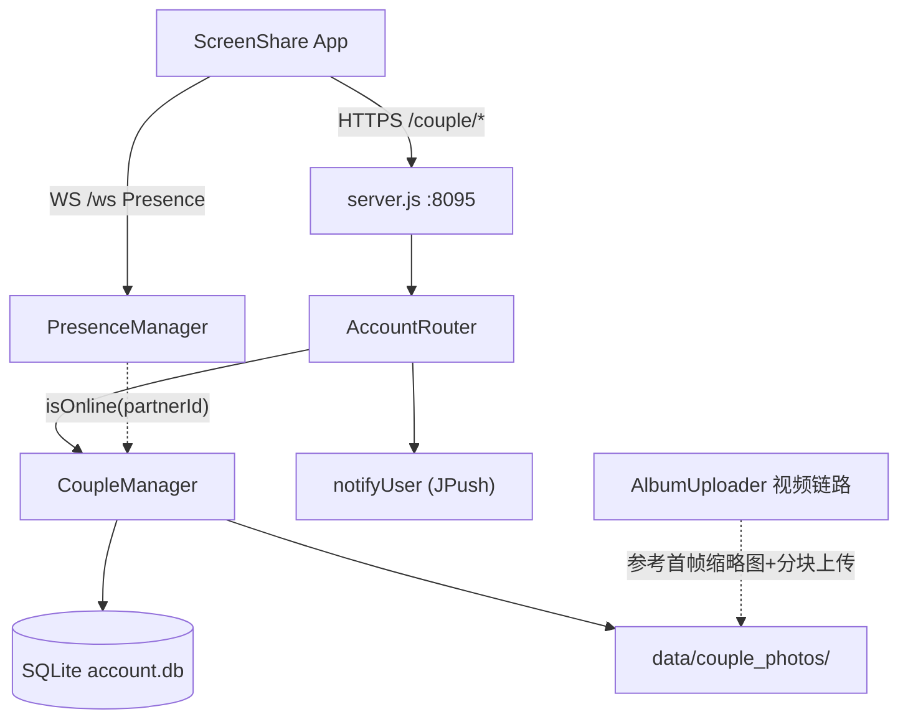
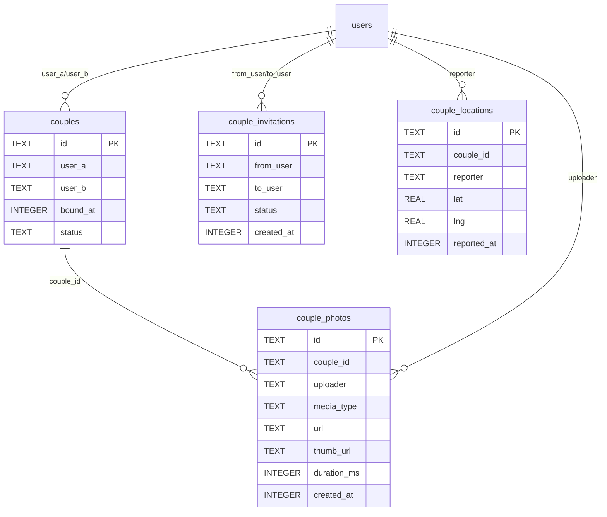

# 情侣绑定与情侣空间 技术设计

Feature Name: couple-binding
Updated: 2026-09-21

## Description

在现有账号/好友体系上扩展情侣绑定能力：服务端新增 CoupleManager（绑定邀请、唯一性约束、解绑、共享相册、位置共享）与四张表，客户端新增 CoupleClient（API 封装）与情侣空间页面。邀请通知复用现有 notifyUser（JPush 推送）；照片/视频媒体落盘到服务器 data 目录（视频上传复用 AlbumUploader 的分块 + 首帧缩略图模式），元数据入库；在线状态复用 PresenceManager。

## Architecture



服务端分层与现有结构一致：AccountRouter 做路由与鉴权，CoupleManager 承载全部业务逻辑，数据库操作经 db.js 句柄，推送经 notifyUser。

## Components and Interfaces

### 服务端：`server/CoupleManager.js`

```js
class CoupleManager {
  constructor(db, presence) { this.db = db; this.presence = presence; }
  invite(fromUserId, friendCode)         // 发起邀请（校验唯一性、推送通知）
  invitations(userId)                    // 待处理邀请列表
  accept(userId, invitationId)           // 建立双向绑定 + 自动加好友 + 推送双方
  reject(userId, invitationId)
  space(userId)                          // 空间首页：伴侣信息 + 在线 + 在一起天数 + 相册摘要 + 伴侣最近位置
  uploadPhoto(userId, fileMeta)          // 照片上传（仅已绑定）
  createVideo(userId, meta)              // 视频建单（返回 videoId + 预期分块数）
  uploadVideoChunk(userId, videoId, offset, chunk)  // 分块写入
  finishVideo(userId, videoId)           // 合并 + 首帧缩略图 + 入库
  listPhotos(userId)                     // 媒体列表（照片+视频混合，时间倒序）
  deletePhoto(userId, mediaId)           // 删除（仅绑定成员）
  reportLocation(userId, lat, lng)       // 上报位置（仅当前 couple 可见）
  dissolve(userId)                       // 单方解绑，保留内容不可上传
  _clearSpace(userId)                    // 新绑定时清空旧空间内容（媒体+位置）
  _coupleOf(userId)                      // 查生效绑定 {coupleId, partnerId, boundAt}
}
```

### 服务端：`server/AccountRouter.js` 新增路由

| 方法 | 路径 | 鉴权 | 说明 |
|------|------|------|------|
| POST | `/couple/invite` | 是 | body: `{friendCode}` |
| GET | `/couple/invitations` | 是 | 待处理邀请 |
| POST | `/couple/accept` | 是 | body: `{invitationId}` |
| POST | `/couple/reject` | 是 | body: `{invitationId}` |
| GET | `/couple` | 是 | 空间首页（含在线/天数/伴侣位置） |
| POST | `/couple/photos` | 是 | 照片 multipart 上传 |
| POST | `/couple/videos` | 是 | 视频建单 `{size,duration}` |
| POST | `/couple/videos/:id/chunks` | 是 | 分块上传 `{offset, chunk(base64)}` |
| POST | `/couple/videos/:id/finish` | 是 | 合并完成，生成缩略图 |
| GET | `/couple/photos` | 是 | 媒体列表 |
| DELETE | `/couple/photos/:id` | 是 | 删除单个媒体 |
| POST | `/couple/location` | 是 | body: `{lat, lng}` |
| POST | `/couple/dissolve` | 是 | 解绑 |

### 客户端：`app/.../CoupleClient.kt`

复用 AccountClient 的 `call()` 风格（同 baseUrl、同 token 透传）：

```kotlin
suspend fun invite(token, friendCode): ApiResult<Unit>
suspend fun getInvitations(token): ApiResult<List<CoupleInvitation>>
suspend fun accept(token, invitationId): ApiResult<CoupleBindResult>
suspend fun reject(token, invitationId): ApiResult<Unit>
suspend fun getSpace(token): ApiResult<CoupleSpace>        // 含 days、online、partner、location、photoCount
suspend fun uploadPhoto(token, file: File): ApiResult<Unit>
suspend fun createVideo(token, size: Long, duration: Long): ApiResult<VideoSession>
suspend fun uploadVideoChunk(token, videoId: String, offset: Int, chunk: ByteArray): ApiResult<Unit>
suspend fun finishVideo(token, videoId: String): ApiResult<Unit>
suspend fun getPhotos(token): ApiResult<List<CoupleMedia>>
suspend fun deletePhoto(token, mediaId: String): ApiResult<Unit>
suspend fun reportLocation(token, lat: Double, lng: Double): ApiResult<Unit>
suspend fun dissolve(token): ApiResult<Unit>
```

### 客户端页面

- `CoupleFragment.kt` + `fragment_couple.xml`：空间主页。未绑定时展示好友码输入框 + 邀请列表；已绑定时展示双方头像、在线状态（PresenceClient 推动刷新）、在一起天数、伴侣最近位置、相册九宫格入口
- `CouplePhotosActivity.kt`：相册网格页（照片+视频缩略图混合、上传、查看、删除）
- 底部导航（MainActivity/fragment_home）加入「情侣」入口
- 位置上报：空间页可见时按固定间隔（60s）调用 `reportLocation`

## Data Models



- `couples`：双向对称写两行（user_a/user_b 交换），status 取值 `active`/`dissolved`，便于「同一用户最多一组生效绑定」的查询与解绑
- `couple_invitations`：status 取值 `pending`/`accepted`/`rejected`
- `couple_photos`：以 couple_id 归属；`media_type` 取值 `photo`/`video`；视频记录 `thumb_url`（首帧）与 `duration_ms`；解绑后记录保留（status=dissolved 的 couple 仍可查），重新绑定新伴侣时按旧 couple_id 清除
- `couple_locations`：每次上报插入新行并保留最新一条（查询按 reporter + couple_id 取 reported_at 最大）；只对同 couple 成员可见，解绑后不向新伴侣暴露，新绑定时清除

迁移：db.js `init()` 中 `CREATE TABLE IF NOT EXISTS` 四张表，零破坏升级。

## Correctness Properties

1. **唯一绑定**：建立绑定前对双方各执行「生效绑定存在性」检查；couples 表对 (user, status='active') 至多一组
2. **对称性**：绑定/解绑均双写两行，任一查询返回的伴侣关系对双方一致
3. **鉴权**：所有相册操作校验调用者属于该 couple 的生效成员；删除媒体校验媒体归属其当前 couple
4. **在一起天数**：由服务端按 `bound_at` 计算，客户端只展示，避免设备时区/时间差异
5. **内容生命周期**：解绑 → 内容只读；新绑定 → 旧内容清除（媒体 + 位置），且仅清除该用户参与的历史 couple
6. **位置可见性**：`couple_locations` 查询必须同时满足 reporter 为查询者当前 couple 的伴侣、且 couple 状态 active；位置上报必须当前处于生效绑定
7. **视频完整性**：分块 offset 严格顺序写入临时文件，`finish` 时校验累计字节数等于建单声明的 size，否则拒绝入库

## Error Handling

| 场景 | 处理 |
|------|------|
| 好友码无效/不存在 | 400 `invalid_code` |
| 自己邀请自己 | 400 `self_request` |
| 任一方已生效绑定 | 409 `already_bound`（附提示文案） |
| 邀请不存在或已处理 | 404 `not_found` / 409 `invalid_state` |
| 未绑定时操作相册/位置 | 403 `not_bound` |
| 照片超 10MB 或非图片 | 400 `invalid_file` |
| 视频超 100MB / 分块乱序 / 字节数不符 | 400 `invalid_video` |
| 删除非本人 couple 的媒体 | 403 `forbidden` |
| 位置坐标非法（超出经纬度范围） | 400 `invalid_location` |

错误返回沿用现有 `{error, message}` 结构，客户端按 code 展示中文提示。

## Test Strategy

- 服务端：`server/test/couple.test.js`，表驱动覆盖邀请→接受→唯一性冲突→照片/视频上传→位置上报→解绑→新绑定清空 全链路；node --test 全量回归
- 客户端：CoupleClient 接口与解析的单测；未绑定/已绑定两种 UI 状态的编译期校验
- 端到端：两台测试机分别注册账号，A 邀请 B → B 接受 → 双方空间页显示在线状态与在一起天数 0 天 → A 上传照片与视频 B 侧立即可见（视频网格显示首帧缩略图）→ A 上报位置 B 侧显示最近位置 → A 解绑 → 双方仍可看媒体但上传按钮置灰 → 任一方新绑定 → 旧空间内容清空

## References

[^1]: (server/FriendManager.js) 好友关系管理，情侣绑定的对称双写与自动加好友参考其 `_makeFriends`
[^2]: (server/AccountRouter.js#L62) 路由注册与 notifyUser 推送模式
[^3]: (app/src/main/java/com/screenshare/AccountClient.kt#L105) 客户端 call() 封装风格
[^4]: (server/db.js#L16) 建表与迁移模式
[^5]: (server/PresenceManager.js#L36) isOnline 判定，空间页在线状态数据源
[^6]: (app/src/main/java/com/screenshare/AlbumUploader.kt#L296) 视频首帧缩略图与分块上传模式，情侣视频上传复用
