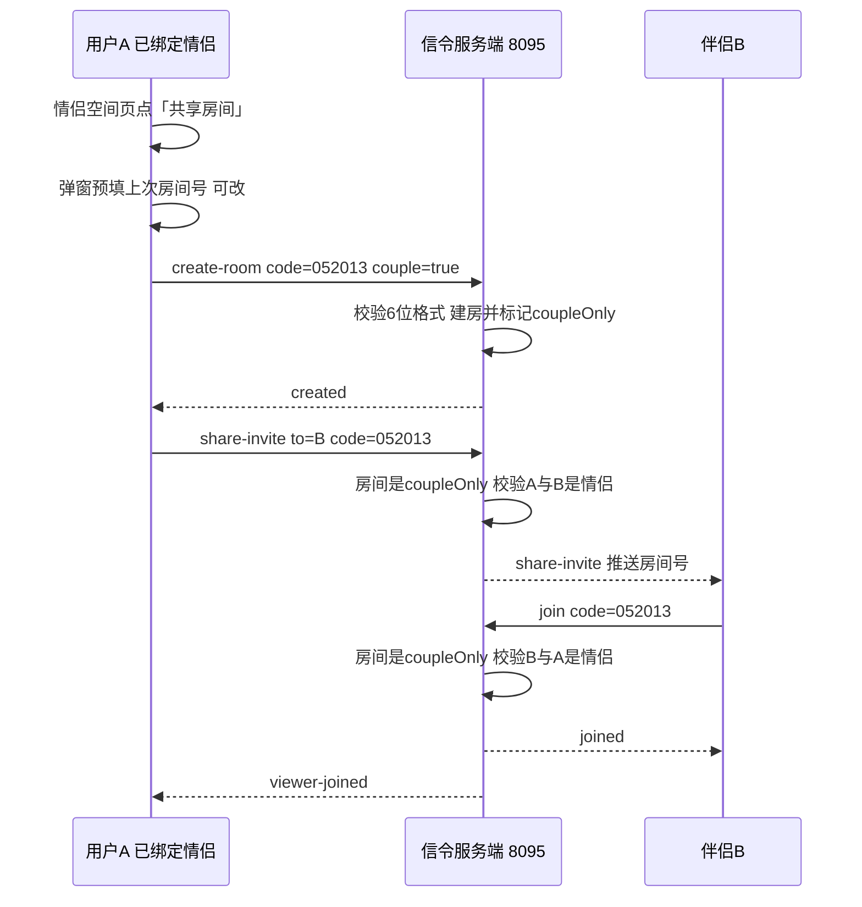

# 情侣共享房间

Feature Name: couple-share-room
Updated: 2026-09-29

## Description

为已绑定情侣的用户提供「共享房间」入口：以自定义的 6 位房间号建立屏幕共享房间，房间号默认记住、可随时修改，伴侣可一键加入。房间标记为情侣专属，服务端在建房邀请与加入两个环节实时校验情侣关系，解绑后立刻失效。普通好友共享不受影响（不带情侣标记的房间不做关系校验）。

## Architecture

关键决策：**情侣专属性靠房间标记而非全局开关**。建房时客户端传 `couple: true`，房间对象记录 `coupleOnly`；只有 coupleOnly 房间才在 share-invite 与 join 时校验情侣关系，普通好友共享（不带标记）完全不受影响，避免误伤现有功能。

## Components and Interfaces

### 服务端

- **RoomManager**（`server/RoomManager.js`）
  - `isValidCode`：格式从 4 位数字放宽为 6 位数字 `/^[0-9]{6}$/`
  - `create(code, hostWs, hostUserId, coupleOnly)`：房间对象新增 `coupleOnly` 字段（默认 false）
  - `isCoupleRoom(code)`：返回房间是否带情侣标记（供 join/invite 分支判断）
- **CoupleManager**（`server/CoupleManager.js`）
  - 新增 `areCouple(a, b)`：查 couples 表 status=active 且双方匹配（双向 OR），实时查库，解绑后自动返回 false
- **server.js**
  - create-room 分支：读取 `msg.couple` 传入 `rooms.create`；错误文案「4 位」改「6 位」
  - join 分支：若 `rooms.isCoupleRoom(code)` 且校验失败，返回「仅情侣可加入共享房间」
  - share-invite 分支：若房间 coupleOnly 且邀请对象非 host 情侣，返回「仅情侣可加入共享房间」

### 客户端

- **CoupleShareStarter**（新建，`app/src/main/java/com/screenshare/CoupleShareStarter.kt`）
  - `start(context, partner)`：弹出房间号编辑对话框，预填 SharedPrefs 记住的房间号；确认时做 6 位本地校验，通过后跳 MainActivity（CREATE + 房间号 + 邀请伴侣 + `EXTRA_COUPLE_ROOM=true`）
  - `savedCode(context)` / `saveCode(context, code)`：SharedPrefs 读写（key `couple_room_code`）
- **CoupleFragment**：已绑定视图（boundView）内新增「共享房间」按钮，点击调用 `CoupleShareStarter.start`
- **MainActivity**：读取 `EXTRA_COUPLE_ROOM`，create-room 消息追加 `couple: true`；建房成功后保存房间号
- **PresenceClient**：无需改动，share-invite 推送复用现有链路（伴侣收到邀请弹窗可直接加入）

## Data Models

- 房间对象（内存）：`{ host, hostUserId, viewers, pending, reconnecting, coupleOnly }`
- couples 表（已有，无变更）：`(id, user_a, user_b, status)`，status=active 表示有效
- 客户端 SharedPrefs：`couple_room_code` → 上次成功使用的 6 位房间号

## Correctness Properties

1. 只有 coupleOnly 房间做情侣校验，普通好友共享行为不变
2. 情侣校验在 share-invite 与 join 两处独立进行，任一环节解绑都会导致后续操作被拒
3. 房间号冲突时复用现有死房间回收逻辑（host socket 已关闭则回收）
4. 6 位格式校验在客户端与服务端双重执行
5. 加入环节校验的是 viewer 与房间 hostUserId 的关系，与发起邀请者身份解耦

## Error Handling

| 场景 | 处理 |
|------|------|
| 房间号非 6 位 | 客户端就地提示「请输入 6 位数字房间号」；服务端兜底拒绝 |
| 房间号被在用房间占用 | 服务端返回「会议号已被占用，请重试」，弹窗保留输入便于改号重试 |
| 非情侣加入 coupleOnly 房间 | 服务端拒绝「仅情侣可加入共享房间」 |
| 解绑后加入记住的房间号 | 同上（areCouple 实时查库返回 false） |
| 伴侣已有 viewer 在房间 | 沿用现有「仅支持 1 对 1 共享」拒绝 |

## Test Strategy

1. **服务端单测**：6 位格式校验、coupleOnly 标记传递、areCouple 双向匹配与解绑失效、非情侣加入被拒、非情侣邀请被拒、普通房间（无标记）不校验情侣
2. **客户端验证**：弹窗预填/记住/改号、6 位本地校验、冲突失败保留输入
3. **端到端**：两账号绑定情侣 → A 建自定义房间号 → B 收邀请加入 → 解绑 → B 再加入被拒

## References

[^1]: (RoomManager.js#L41) `isValidCode` 房间号格式规则
[^2]: (RoomManager.js#L47) `create` 建房与死房间回收
[^3]: (server.js#L494) create-room 分支
[^4]: (server.js#L701) share-invite 分支与 host 归属校验
[^5]: (CoupleManager.js#L151) `space` 与 `_activeCoupleOf` 情侣关系查询
[^6]: (FriendShareStarter.kt) 现有好友共享发起流程（随机 4 位房间号）
