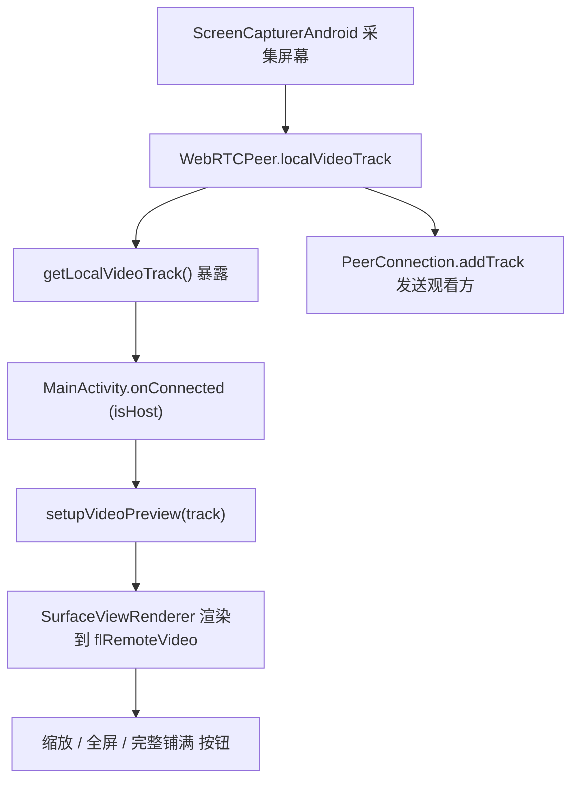
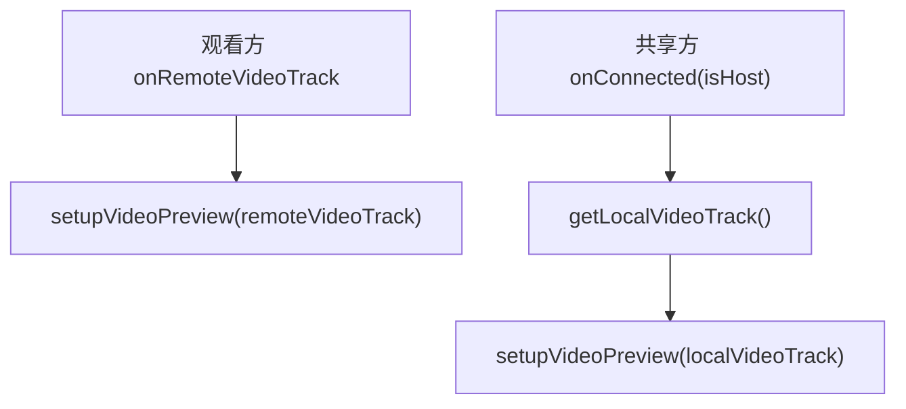

# 共享方本地视频预览

Feature Name: host-video-preview
Updated: 2026-08-05

## Description

共享方在 P2P 连接建立后，将本地屏幕采集视频轨道（`localVideoTrack`）渲染到现有画面区（`flRemoteVideo`），复用观看方全部渲染与交互逻辑（双指缩放、全屏、完整/铺满切换、方向适配）。

设计目标：**零新增渲染逻辑**。将现有 `onRemoteVideoTrack` 中的渲染代码抽取为通用方法，观看方绑定远程轨道、共享方绑定本地轨道，两条路径走同一套代码。

## Architecture

## Components and Interfaces

### Components 1：WebRTCPeer 暴露本地视频轨道

- 新增方法 `fun getLocalVideoTrack(): VideoTrack?`，返回私有字段 `localVideoTrack`（WebRTCPeer.kt:102）
- 仅在 `isHost` 场景调用；观看方不受影响

### Components 2：MainActivity 统一预览渲染

- 将现有 `onRemoteVideoTrack`（MainActivity.kt:778）中渲染代码抽取为
  `private fun setupVideoPreview(track: VideoTrack)`
- `setupVideoPreview` 内部逻辑与现有一致：
  - 移除旧 sink/renderer，创建 `SurfaceViewRenderer` 并 init
  - 默认 `SCALE_ASPECT_FIT`（完整显示），支持缩放/双击复位
  - 显示 `tvZoomHint`/`btnFullscreen`/`btnAspectToggle`
  - 设置 `remoteVideoSink` 更新 `lastFrameW/H` 并调用 `applyModeScale()`
  - 注册容器尺寸变化监听 + `prepareFullscreenRenderer()`
  - 设置 `remoteVideoTrack = track`（全屏复用同一渲染链路）
- `onRemoteVideoTrack` 改为调用 `setupVideoPreview(track)`
- `onConnected`（MainActivity.kt:756）新增 host 分支：
  - `isHost == true`：`peer?.getLocalVideoTrack()?.let { setupVideoPreview(it) }`
  - 观看方分支保持不变（`btnFpsToggle` 仅观看方显示，host 是采集端无需帧率切换）

### Components 3：清理路径

- 现有 `releaseFullscreenRenderer()`/`resetUI()` 使用 `remoteVideoTrack` 变量移除 sink，
  host 预览已将该变量指向本地轨道，断开时自动解绑，无需额外清理
- `cleanupPeer()` 中 `peer.disconnect()` 会 dispose 本地视频轨道，预览 renderer 的
  sink 需在 resetUI 时移除（复用现有逻辑）

## Data Models

无新增数据结构。复用现有：
- `VideoTrack`：本地/远程视频轨道
- `lastFrameW/lastFrameH`：最近一帧分辨率
- `isFitMode`：完整/铺满模式

## Correctness Properties

- 共享方预览与观看方渲染不得互相干扰（两条路径均为同一套方法，天然一致）
- host 端不得显示 `btnFpsToggle`（采集端切换帧率无意义）
- 预览渲染必须发生在主线程（与现有渲染一致）
- `remoteVideoTrack` 仅指向当前活动的轨道（host=本地，viewer=远程）

## Error Handling

- IF `getLocalVideoTrack()` 返回 null（采集未就绪），SHALL 静默跳过预览，不阻断连接
- IF 渲染创建异常，SHALL 记录日志并保持现有行为（不崩溃）
- 断开/退出路径复用现有 `releaseFullscreenRenderer` 与 `resetUI`，无新增错误分支

## Test Strategy

- 构建验证：`assembleDebug` 编译通过
- 实机验证（Host 端）：
  1. 创建会议并授权共享 → 对方加入 → 连接建立后画面区显示本地画面
  2. 双指缩放/单击复位、全屏进出、完整/铺满切换均正常
  3. 旋转屏幕画面适配容器
  4. 对方离开/停止共享后预览消失
- 回归（Viewer 端）：观看方渲染、缩放、全屏、帧率切换不受影响

## References

[^1]: (WebRTCPeer.kt#L102) - [localVideoTrack 字段定义](file:///workspace/app/src/main/java/com/screenshare/WebRTCPeer.kt)
[^2]: (MainActivity.kt#L756) - [onConnected 回调](file:///workspace/app/src/main/java/com/screenshare/MainActivity.kt)
[^3]: (MainActivity.kt#L778) - [onRemoteVideoTrack 现有渲染逻辑](file:///workspace/app/src/main/java/com/screenshare/MainActivity.kt)
