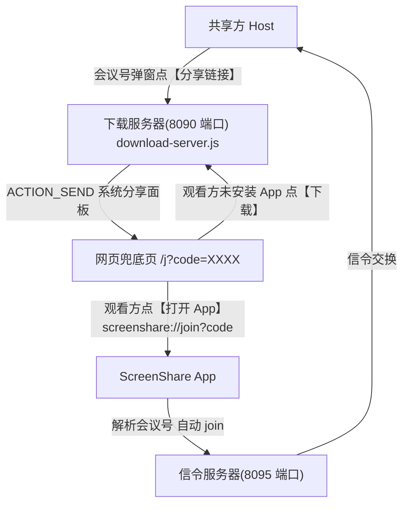

# 分享链接加入共享屏幕

Feature Name: share-link-join
Updated: 2026-08-06

## Description

共享方创建会议后，通过系统分享面板发送一个「分享链接」给观看方。观看方点击 https 链接打开网页兜底页，或在已安装 App 时直接点「打开 App」唤起 ScreenShare 应用，App 解析链接中的会议号并自动执行加入会议流程，无需手动输入 4 位会议号。

## Architecture



- Host 会议号弹窗新增「分享链接」按钮，通过系统分享面板发送链接文案
- https 链接由下载服务器 `/j` 路由渲染兜底页，展示会议号、「打开 App」（scheme 唤起）、「下载 App」
- App 注册 `screenshare://join` 自定义 scheme，冷启动（onCreate）与前台复用（onNewIntent）均解析会议号并自动加入

## Components and Interfaces

### 1. 分享链接文案生成（App 端）

分享文案包含：https 兜底链接、自定义 scheme 链接、可读会议号。格式：

```
【ScreenShare 屏幕共享】
点击链接加入观看我的屏幕：
https://8090-6d639d2de20eb686.monkeycode-ai.online/j?code=1234
会议号：1234（也可在 App 内手动输入）
```

- https 链接：`/j?code=<CODE>`，面向浏览器与未安装场景
- scheme 链接：`screenshare://join?code=<CODE>`，面向已安装 App 的唤起

### 2. 会议号弹窗「分享链接」按钮（MainActivity.kt showMeetingCodeDialog）

- 现有 AlertDialog 增加 neutralButton「分享链接」
- 点击构造分享文案，`startActivity(Intent.createChooser(ACTION_SEND, ...))` 调起系统分享面板
- 保留 positiveButton「复制会议号」与原 negativeButton

### 3. 网页兜底页（server/download-server.js `/j` 路由）

- `GET /j?code=XXXX` 返回 UTF-8 HTML 页面
- 页面元素：
  - 大号 4 位会议号
  - 「打开 App」按钮：`<a href="screenshare://join?code=XXXX">`
  - 「下载 App」按钮：指向 `/ScreenShare-allarch-signed.apk`
  - 说明文案：已安装点打开，未安装先下载
- code 缺失或非法时页面提示「无效链接」

### 4. 自定义 scheme 唤起与自动加入（AndroidManifest.xml + MainActivity.kt）

- MainActivity intent-filter 新增 VIEW 意图：`scheme="screenshare" host="join"`（category DEFAULT + BROWSABLE）
- onCreate 末尾与 onNewIntent 均调用 `handleShareLink(intent)`：
  - data?.scheme == "screenshare" && host == "join" → 读取 `code` query 参数
  - code 匹配 `^[0-9]{4}$` → 校验当前状态后调用 `joinMeetingWithCode(code)`
  - 无效 → Toast「无效的分享链接」
  - 当前正在共享/连接中 → Toast「当前会话进行中，无法加入」，保持现有状态

## Data Models

分享链接参数（query string）：

| 字段 | 类型 | 说明 |
|------|------|------|
| code | string | 4 位数字会议号，缺省或非法视为无效链接 |

## Correctness Properties

- 分享链接与当前会议号严格一致（从 `signalCode` 读取，不新生成）
- scheme 唤起后解析出的 code 必须通过 `^[0-9]{4}$` 校验才触发加入
- 加入动作与手动输入会议号共用 `joinMeetingWithCode`，行为完全一致
- 无效链接不发起任何信令连接

## Error Handling

| 场景 | 处理 |
|------|------|
| 分享面板无可用应用 | ACTION_SEND 异常捕获，Toast 提示后回退到「复制会议号」 |
| 链接缺少 code / 非 4 位数字 | Toast「无效的分享链接」，不发起加入 |
| App 已在共享或加入中 | Toast「当前会话进行中，无法加入」，保持现有会话 |
| 网页 code 缺失/非法 | 页面显示「无效的分享链接」，仍提供下载入口 |

## Test Strategy

- 单元/手工验证：
  - Host 创建会议 → 点「分享链接」→ 系统分享面板出现且文案含两个链接与会议号
  - 观看方未装 App：浏览器打开 https 链接 → 显示会议号与下载入口
  - 观看方已装 App：点「打开 App」→ App 唤起并自动进入加入流程
  - App 前台运行收到 scheme intent → onNewIntent 正确触发加入
  - 无效链接（错码/无码）→ Toast 提示且不加入
  - 共享中收到 scheme → 提示不可加入且会话不中断

## References

[^1]: (server/server.js#L1-L23) - 信令协议：create/join/relay
[^2]: (server/download-server.js) - 下载服务器，承载 APK 与 /version.json，新增 /j 路由
[^3]: (app/src/main/java/com/screenshare/MainActivity.kt#L698-L740) - showMeetingCodeDialog 会议号弹窗
[^4]: (app/src/main/java/com/screenshare/MainActivity.kt#L776-L793) - joinMeetingWithCode 加入流程
