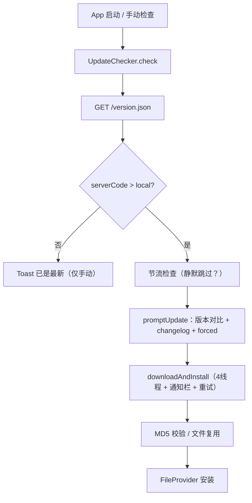
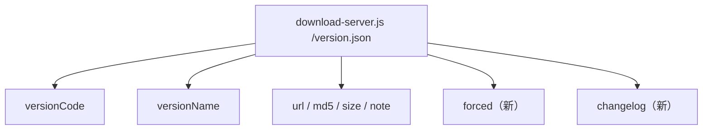

# 检查更新优化

Feature Name: update-checker-improvement
Updated: 2026-08-05

## Description

重构 `UpdateChecker`（UpdateChecker.kt）：
1. 更新提示展示版本号、更新说明（changelog）、当前/目标版本对比、包大小；支持强制更新（forced=true 时无跳过按钮）
2. 下载转入通知栏进度（NotificationCompat，非前台服务），下载可后台进行、可取消、失败自动重试
3. 下载线程数 2 → 4，分段失败单独重试
4. 启动静默检查 + 12 小时节流（SharedPreferences）
5. 已下载同版本文件 MD5 校验通过则复用，避免重复下载

服务端 `/version.json` 扩展 `forced`（bool）与 `changelog`（多行字符串）字段。

## Architecture





## Components and Interfaces

### Components 1：服务端 version.json 扩展（server/download-server.js）

- `getVersion()` 返回对象新增：
  - `forced: true/false`（本次发布是否强制更新；由 note 或独立配置决定，默认 false）
  - `changelog: string`（多行更新说明，客户端直接展示；当前版本使用 note 相同内容）

### Components 2：UpdateChecker 重构（app/src/main/java/com/screenshare/UpdateChecker.kt）

- `check(context, manual)`：
  - 新增节流：非 manual 时读取 SharedPreferences `last_auto_check`，距今 < 12h 则跳过（静默）
  - 成功请求后无论结果如何更新 `last_auto_check`
  - 静默检查失败静默忽略（现有已是）
- `promptUpdate(context, info)`：
  - 标题：「发现新版本 v${versionName}」
  - 内容：changelog（存在时展示，否则用 note）+「当前版本 v${localVersion} → 新版本 v${remoteVersion}」+「大小 ${size}」
  - `forced == true`：不显示「暂不」按钮；否则保留
- `downloadAndInstall(context, info)`：
  - 文件复用：目标文件（`update-{versionName}.apk`）存在且 `md5` 匹配 → 直接安装
  - 通知栏：`NotificationCompat` + `NotificationManager`，channel `update_channel`；标题「正在下载更新」、文本含版本号与进度、progress max=100、ongoing=true；完成转「下载完成，正在安装」；取消按钮 `setContentIntent` 暂停/取消；通知使用 `applicationContext`
  - 线程数 `THREAD_COUNT = 4`；每段失败单独重试至多 3 次（`retryOnError`），重试完成后仍有失败才整体报错
  - 下载完成后移除通知（安装由系统安装页接管）
  - Android 13+ 通知权限：下载前 `POST_NOTIFICATIONS` 运行时申请（activity 上下文），未授权则降级为 Activity 内进度条（保持现有弹窗逻辑）
- 权限清单：`AndroidManifest.xml` 新增 `POST_NOTIFICATIONS`（Android 13+ 运行时请求，targetSdk 34 需要声明）

### Components 3：MainActivity 集成

- 现有 `UpdateChecker.check(this)`（onCreate 静默）与 `tvCheckUpdate`（手动）调用不变
- 手动检查触发时强制绕过节流（manual=true 已满足）

## Data Models

`version.json`（扩展后）：
```json
{
  "versionCode": 67,
  "versionName": "1.66",
  "url": "https://.../ScreenShare-allarch-signed.apk",
  "md5": "11d863...",
  "size": 24383289,
  "note": "本次更新说明（单行摘要）",
  "forced": false,
  "changelog": "第一行说明\n第二行说明\n..."
}
```

SharedPreferences key：`update_auto_check_ts`（Long，Unix 毫秒）。

## Correctness Properties

- 静默检查节流：距上次静默检查 12h 内不得再次静默检查；手动检查不节流
- 强制更新：`forced=true` 时弹窗不得提供跳过路径
- 文件复用：仅当同版本文件 MD5 校验通过才复用；失败必须删除重下
- 分段重试：单段失败重试不阻塞其他段；整体失败仅当所有重试耗尽
- 通知生命周期：开始创建、进度更新、取消清除、完成移除（不残留）

## Error Handling

- IF 网络请求失败，静默检查静默忽略，手动检查 Toast 提示
- IF 分段下载耗尽重试仍失败，通知栏显示「下载失败」，清理临时文件
- IF 通知权限未授予（Android 13+），降级使用 Activity 内进度条弹窗（现逻辑），下载功能不受影响
- IF 已下载文件 MD5 不匹配，删除文件并重新下载
- 安装失败沿用现有 Toast 反馈

## Test Strategy

- 构建验证：`assembleDebug` 编译通过
- 服务端验证：`curl /version.json` 确认 forced/changelog 字段返回
- 实机验证：
  1. 手动检查 → 弹窗展示版本对比、更新说明、大小；有新版时点击立即更新
  2. 下载时通知栏显示进度条，可切到其他应用，可取消
  3. 断网重试逻辑、下载完成自动进入安装
  4. 连续启动两次，第二次启动（12h 内）无网络请求（节流）
- 回归：手动检查「已是最新版本」Toast、旧版更新安装流程正常

## References

[^1]: (UpdateChecker.kt) - [现有实现](file:///workspace/app/src/main/java/com/screenshare/UpdateChecker.kt)
[^2]: (server/download-server.js#L27) - [getVersion 元数据](file:///workspace/server/download-server.js)
[^3]: (gradle.properties#L19) - [UPDATE_URL 配置](file:///workspace/gradle.properties)
