# 观看方远程控制共享方

Feature Name: viewer-remote-control
Updated: 2026-08-05

## Description

为屏幕共享应用新增「观看方远程控制共享方」能力。观看方开启控制模式后，在共享画面上单指触摸即产生控制指令，经 WebRTC 控制数据通道（CONTROL_LABEL）下发；共享方侧 `RemoteControlService`（AccessibilityService）解析指令并模拟执行（触摸手势、系统按键、文本输入）。共享方提供无障碍服务引导开启与「停止远程控制」开关。

## Architecture

```mermaid
graph LR
    V["观看方 MainActivity"]
    VS["RemoteControlPanel(UI)"]
    VT["onTouch 控制模式捕获"]
    VC["sendControl(JSON)"]
    W["WebRTCPeer CONTROL_LABEL"]
    H["WebRTCPeer CONTROL_LABEL(共享方)"]
    HO["registerControlObserver 分发"]
    RC["RemoteControlService(无障碍)"]
    SYS["Android 系统手势/按键/文本执行"]

    V --> VS
    VS --> VT
    VT --> VC
    VC --> W
    W -->|"加密 P2P 数据通道"| H
    H --> HO
    HO --> RC
    RC --> SYS
```



数据通道复用现有 `CONTROL_LABEL`（ordered=true，可靠有序），无需新增通道。

## Components and Interfaces

### 1. RemoteControlService（新增，共享方侧）

AccessibilityService 实现，单例静态引用，供 `MainActivity`/控制观察者调度。

```kotlin
object RemoteControl {
    @Volatile var service: RemoteControlService? = null
    var controlEnabled: Boolean = true        // 共享方「停止远程控制」开关
    val isActive: Boolean get() = service != null && controlEnabled
}
```

接口：

- `execute(cmd: JSONObject)`：解析并执行单条指令（触摸/按键/文本）
- `fun isAccessibilityOn(): Boolean`：服务是否已开启
- `fun screenSize(): Pair<Int, Int>`：真实屏幕宽高（服务连接时缓存）

指令执行方式：

| 指令 | 实现 |
|------|------|
| touch down/move/up | `dispatchGesture(StrokeDescription(Path,0,1ms))`，坐标 `x=nx*W, y=ny*H` |
| key | `performGlobalAction(GLOBAL_ACTION_BACK/HOME/RECENTS)` |
| text | `rootInActiveWindow` 找 `isFocused()` 的可编辑节点，`performAction(ACTION_SET_TEXT, bundle)` |

### 2. WebRTCPeer（修改）

- 共享方 `registerControlObserver` 增加指令分发：`type` 非 `fps` 时转为 `RemoteControl.execute(cmd)`；`type=="fps"` 保持原逻辑
- 控制通道 `sendMessage()`（共享方回发）暴露：回发「无障碍未开启 / 文本输入失败 / 已停止控制」提示给观看方
- 观看方新增 `registerControlObserver` 接收回发提示（当前仅共享方注册）

### 3. MainActivity（修改）

观看方侧：

- 控制模式开关按钮 `btnRemoteControl`（右上角，与控制相关按钮同区），开启后高亮
- 系统按键栏：`btnCtrlBack` / `btnCtrlHome` / `btnCtrlRecents`
- 文本输入：`btnCtrlText` 弹 Dialog 输入，提交后发送 text 指令
- `renderer.setOnTouchListener` 分支：控制模式下单指（pointerCount==1）→ 实时发送 touch 指令；双指仍走 `ScaleGestureDetector`；非控制模式保持现状
- 收到回发提示 Toast 展示

共享方侧：

- 状态卡片 `tvCtrlStatus`：无障碍开启 →「远程控制已就绪」；未开启 →「未开启无障碍服务，观看方无法控制」+ 按钮跳转 `Settings.ACTION_ACCESSIBILITY_SETTINGS`
- 「停止远程控制」开关 `btnCtrlLock`，关闭后忽略全部控制指令

### 4. 布局与配置（修改）

- `activity_main.xml`：新增观看方控制栏（开关/系统键/文本）、共享方状态区
- `res/xml/accessibility_service_config.xml`（新增）：`canPerformGestures="true"`、`canRetrieveWindowContent="true"`、`accessibilityEventTypes="typeWindowStateChanged"`
- `AndroidManifest.xml`：注册 `RemoteControlService`，`android:permission="BIND_ACCESSIBILITY_SERVICE"`

## Data Models

控制指令协议（UTF-8 JSON，经 CONTROL_LABEL 传输）：

```json
{"type":"touch","action":"down","nx":0.51,"ny":0.37}
{"type":"touch","action":"move","nx":0.55,"ny":0.40}
{"type":"touch","action":"up","nx":0.55,"ny":0.40}
{"type":"key","value":"back"}            // back | home | recents
{"type":"text","value":"hello"}
{"type":"status-error","code":"no-accessibility"}   // 共享方回发
```

- `nx/ny`：0~1 归一化坐标，共享方按真实屏幕分辨率还原
- `type=="fps"`：保留现有帧率切换，不进入无障碍通道

## Correctness Properties

- 坐标闭环：观看方画面坐标 → 归一化 → 共享方真实像素坐标，方向/比例一致（见坐标映射）
- 指令有序：CONTROL_LABEL ordered=true，保证 down→move→up 顺序执行
- 控制开关一致：共享方 `controlEnabled=false` 时所有指令忽略；观看方开关状态与会话状态同步（断开自动退出控制模式）
- 无障碍缺省安全：服务未开启时不执行任何指令，并回发提示
- 权限最小化：无障碍服务不读取/上传屏幕内容，仅执行坐标与按键指令

## Error Handling

| 场景 | 处理 |
|------|------|
| 共享方无障碍服务未开启 | 共享方忽略指令并回发 `status-error/no-accessibility`，观看方 Toast 提示 |
| 观看方点控制开关但通道未就绪 | 开关禁用，Toast 提示连接未就绪 |
| 文本输入无聚焦输入框 | 共享方回发失败提示，观看方 Toast 提示 |
| dispatchGesture 被系统取消 | 共享方日志记录，不重试（避免重复操作） |
| 会议退出/通道断开 | 共享方停止执行后续指令，观看方自动退出控制模式 |

## Test Strategy

- **坐标映射单测**：归一化/还原公式、fit 黑边内容矩形计算、铺满裁切映射（Kotlin 纯函数可测）
- **真机联调（两台手机）**：
  1. 观看方开启控制模式，单指点按/滑动/长按 → 共享方界面出现对应响应
  2. 返回/主页/最近任务按键 → 共享方执行全局动作
  3. 文本输入 → 聚焦输入框出现文字
  4. 关闭共享方无障碍服务 → 观看方收到提示且无操作生效
  5. 关闭共享方「停止远程控制」→ 观看方指令全部忽略
  6. 竖屏/横屏切换后控制不偏移
- **回归**：原有 fps 切换、缩放、麦克风、系统音频功能不受影响

## References

[^1]: (Filename#Lnnn) - [WebRTCPeer.kt](file:///workspace/app/src/main/java/com/screenshare/WebRTCPeer.kt) CONTROL_LABEL 定义 L41-42、createControlChannel L346、registerControlObserver L378
[^2]: (Filename#Lnnn) - [MainActivity.kt](file:///workspace/app/src/main/java/com/screenshare/MainActivity.kt) 观看方 renderer onTouch L916、共享方预览 onTouch L1041、onFpsToggleClicked L153
[^3]: (Filename#Lnnn) - [AndroidManifest.xml](file:///workspace/app/src/main/AndroidManifest.xml) 服务注册区
