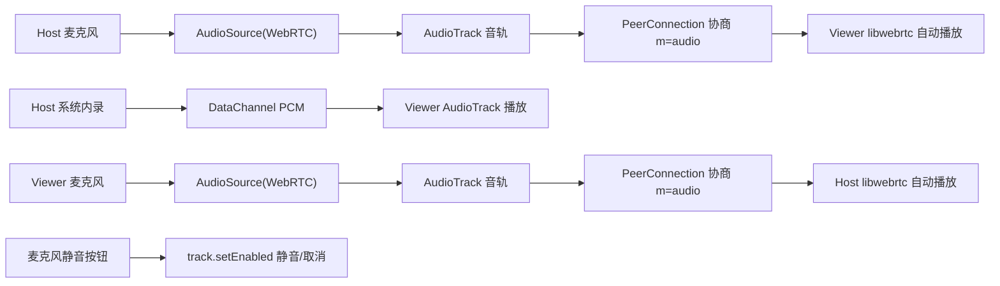

# 会议内麦克风语音（voice-mic-in-meeting）

Feature Name: voice-mic-in-meeting
Updated: 2026-08-05

## Description

在现有 ScreenShare 会议（会议号模式，一对一双向 WebRTC 连接）中新增**双向麦克风语音**：
会议双方（共享方 Host / 观看方 Viewer）均可采集麦克风音频，通过 WebRTC 标准音频轨道（Opus 编码）实时传输给对方，实现全双工对讲。麦克风语音与既有系统内录音频（经 DataChannel 传输的屏幕声音）**叠加播放**，互不干扰。

主要变化：
1. 新增麦克风音频轨道（AudioSource + AudioTrack）随 PeerConnection 协商传输（m=audio）。
2. 开启/关闭/静音麦克风时对既有连接做 **renegotiation（重新协商）**，无需重建连接。
3. 观看端支持在已连接状态下接收重协商 Offer（复用 PeerConnection，不再重建）。
4. 新增麦克风按钮与静音状态 UI，麦克风权限按需请求。

## Architecture

说明：
- 麦克风语音走 **WebRTC 标准音频管线**：编码（Opus）、回声消除（AEC）、噪声抑制（NS）、自动增益（AGC）、抖动缓冲与丢包隐藏均由 libwebrtc 内置处理，延迟低、抗丢包。
- 系统内录音频维持既有 DataChannel 通道不变（PCM → 观看端 AudioTrack 播放）。
- 两路音频在观看端设备同时输出，由设备级混音实现"语音 + 屏幕声音"叠加。

## Components and Interfaces

### 1. `WebRTCPeer`（`app/src/main/java/com/screenshare/WebRTCPeer.kt`）

新增成员：
- `private var micAudioSource: AudioSource?` / `private var micAudioTrack: org.webrtc.AudioTrack?` / `private var micSender: org.webrtc.RtpSender?`
- `fun startMicAudio(): Boolean` —— 创建 AudioSource（`AudioConstraints`，`googEchoCancellation:true`、`googNoiseSuppression:true`）与 AudioTrack，`peerConnection.addTrack`，随后由调用方触发重协商；失败返回 false。
- `fun stopMicAudio()` —— `removeTrack` + `dispose` 音频源与轨道，随后由调用方触发重协商。
- `fun setMicMuted(muted: Boolean)` —— 直接 `micAudioTrack.setEnabled(!muted)`，**不重协商**（发送静音帧）。
- `fun renegotiate()` —— 复用 `createOffer()` 流程重新生成并发送 Offer（含新增音频轨道）。

重协商需保证主线程调用（既有 createOffer 的线程约束）。

### 2. `MainActivity`（`app/src/main/java/com/screenshare/MainActivity.kt`）

- 新增麦克风按钮（`btnMic`，置于视频区按钮列），点击流程：
  - 未开启：请求 `RECORD_AUDIO` 运行时权限 → 授权成功调 `peer.startMicAudio()` + `renegotiate()`，UI 显示"麦克风已开启"；拒绝则提示。
  - 已开启：`peer.setMicMuted(!muted)` 切换静音，UI 显示静音状态。
- 会议退出/断开（`cleanupPeer`）时调用 `peer.stopMicAudio()`，重置麦克风 UI 状态。
- **修改 `handleSignalRelay` 的 OFFER 分支**（`MainActivity.kt:618`）：由"每次新建 PeerConnection"改为"`peer == null` 时才创建，否则复用现有 peer 直接 `setRemoteDescription`"，以支持连接建立后的重协商 Offer。
- 麦克风默认状态：会议建立（PeerConnection 就绪）后**默认关闭**，由用户手动开启（避免未经授权采集、减少环境噪音）。用户开启一次后本次会话保持。

### 3. 权限（`app/src/main/AndroidManifest.xml`）

`RECORD_AUDIO` 已声明（第 5 行），仅需运行时请求，无需清单改动。

## Data Models

无新增持久化数据。运行时状态：
- `WebRTCPeer`：`micAudioSource`、`micAudioTrack`、`micSender`
- `MainActivity`：`micEnabled: Boolean`、`micMuted: Boolean`

## Correctness Properties

1. 静音/取消静音只影响本端麦克风上行，不影响系统音频、屏幕画面与对方语音。
2. 麦克风开启导致的 renegotiation 不得重建既有连接（复用 peer），避免已建立的 P2P 断连。
3. 关闭麦克风（`stopMicAudio` + 重协商）后，SDP 中移除音频发送方向，但**仍保留接收**（对方可继续说话）。
4. 麦克风权限拒绝时，会议其他功能完全不受影响，UI 明确显示麦克风不可用。
5. 连接断开（`cleanupPeer`）后所有麦克风资源释放，无泄漏。

## Error Handling

| 场景 | 处理 |
|------|------|
| 用户拒绝麦克风权限 | 提示"未授权麦克风，无法使用语音"，麦克风保持关闭，其他功能不受影响 |
| `AudioSource`/`AudioTrack` 创建失败 | 提示"麦克风启动失败"，回退到关闭状态 |
| 重协商 Offer 发送失败 | 保持当前连接，麦克风状态回退为关闭，提示"语音开启失败" |
| 会话进行中对端发来重协商 Offer 而本地 peer 已释放 | 按既有"连接已失效"提示处理 |

## Test Strategy

手动测试清单（真机，手机 ↔ 平板，两端各装一版）：

1. **双向对讲**：Host 开启麦克风说话，Viewer 扬声器听到；Viewer 开启麦克风说话，Host 听到；同时说话全双工无断。
2. **叠加混音**：Host 播放视频/音乐（系统内录），同时说话，Viewer 同时听到语音与屏幕声音。
3. **静音控制**：任一端静音后对方听不到；取消静音恢复；UI 静音状态正确。
4. **重协商稳定性**：Host 开启麦克风前后连接不断（画面/系统音频不中断）；观看端同理。
5. **权限拒绝**：拒绝麦克风权限后会议、屏幕共享、系统音频均正常。
6. **回归**：不开麦克风时行为与 v1.64 完全一致（无音频轨道、无额外权限请求）。

## References

[^1]: (WebRTCPeer.kt#L33-L38) - `WebRTCPeer` 类定义与 companion object
[^2]: (WebRTCPeer.kt#L348-L412) - `startScreenCapture`（现有视频轨道添加逻辑，麦克风轨道参考此模式）
[^3]: (MainActivity.kt#L618-L637) - `handleSignalRelay` OFFER 分支（需改为复用 peer 支持重协商）
[^4]: (AndroidManifest.xml#L5) - `RECORD_AUDIO` 权限已声明
[^5]: (SystemAudioBridge.kt) - 系统音频 DataChannel 通道（不受本次改动影响）
